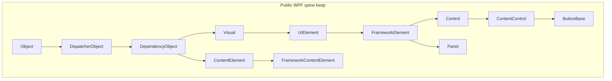

# AeroGUI-R SDK 结构与类层次重整方案

## 结论（先说判断）

本仓库的**产品边界已经比参考项目更干净**：`Aero::Gui` / `Aero::Render` / `Aero::App` / `Aero::Base` 分层、公开头白名单、`GetXxx`/`SetXxx`、constexpr DP、`Result`/`Checked` 双轨，这些都应保留。参考项目 [`C:\Projects\AeroGUI`](C:\Projects\AeroGUI) 是典型 Noesis 形状（`NsGui` 一类型一头文件、`IView`、`AddVisualChild`、Visual 坐标变换齐全），但对象更肥、反射更重。

**不要**把公开模型改成已否决的 Facet/ECS（见 [`docs/WPF_Facet_Pattern_Architecture_Whitepaper.md`](docs/WPF_Facet_Pattern_Architecture_Whitepaper.md)）。WPF 开发者需要的是熟悉的继承与虚函数；C++ 优化应发生在**对象布局、子节点存储、DP store、头文件切分**，而不是换一套公开类型系统。

当前最大的结构性问题是三件事：

1. **Visual 同时当逻辑树和视觉树容器**，每个节点挂两份 `Vector<Visual*>`，且逻辑子被收窄成 `Visual*`（无法正确承载 `ContentElement`/`Inline`）。
2. **公开头文件所有权与 WPF 发现习惯不一致**：多类型挤在一个头里、`DependencyObject` 声明藏在 [`DependencyProperty.hpp`](include/Aero/DependencyProperty.hpp)、Primitives 文件路径与命名空间错位。
3. **个别继承/API 偏离会直接误导 WPF 开发者**（`TabControl : Control` 而不是 `Selector`；没有 `AddVisualChild`/`TransformToVisual`）。



---

## 与参考项目 / WPF 的对照

| 维度 | 参考 AeroGUI | 本项目现状 | 建议 |
| --- | --- | --- | --- |
| Visual 命名空间 | `Aero::Visual`（扁平） | `Aero::Media::Visual` + 头在 [`Visual.hpp`](include/Aero/Visual.hpp) | **保持 Media 命名空间**（更贴近 WPF `System.Windows.Media.Visual`） |
| 子节点 | `AddVisualChild` + 虚 `GetVisualChild`，不在基类存两份列表 | 每个 Visual 存 `logicalChildren_` + `visualChildren_` | 改回 **虚函数 + 派生类自有集合**（C++ 更省、也更 WPF） |
| 坐标 API | `PointFromScreen` / `TransformToVisual` 齐全 | Visual 几乎没有 | **补齐**（上手度高、实现可走 RenderTree 矩阵） |
| 宿主 View | `IView` 接口 | 具体类 [`View`](include/Aero/View.hpp) | **保持具体类**（C++ 嵌入式更简单）；需要时再抽 `IView` 给多实现 |
| 头文件 | ~900 个 `NsGui/*.h` 一类型一文件 | 聚合头：[`StackPanel.hpp`](include/Aero/Controls/StackPanel.hpp) 含 Canvas/Dock/Wrap/UniformGrid；[`HeaderedContentControl.hpp`](include/Aero/Controls/HeaderedContentControl.hpp) 含 Label/Expander/Tab* | **作者可见类型一类型一头文件**；实现 `.cpp` 仍可按族合并 |
| 向下转型 | 反射 `DynamicCast` | `AsUIElement`/`AsFrameworkElement` 虚函数 | 改为 **TypeId `TryCast<T>`**，去掉 4 个虚槽 |
| DP 标识 | 运行时 Register | `constexpr DependencyProperty<T>{"Name"}` | **保留**（C++ 相对 WPF 的明确优势） |
| 属性访问 | `Get/Set` | 同左 | **保留**；不引入属性代理对象 |

公开继承深度建议维持 WPF 形状（约 6–8 层）。这是 XAML/Style/Template 语义的一部分；用组合替代继承只会让 WPF 开发者无法把知识迁移过来。内部引擎已经走 `ElementTree` 服务中枢 + 热字段 + `Rare*`，这条路是对的。

---

## A. 类层次与对象布局（性能关键）

### A1. 把 Visual 从“双列表容器”改成“薄视觉节点”

现状 [`Visual.hpp`](include/Aero/Visual.hpp)：

```69:114:include/Aero/Visual.hpp
    virtual Base::Span<Visual* const> GetVisualChildren() const noexcept {
        return { visualChildren_.Data(), visualChildren_.Size() };
    }
    // ...
    Base::Vector<Visual*> logicalChildren_;
    Base::Vector<Visual*> visualChildren_;
    // renderNodeId_, renderRevision_, handle*, dirty flags, lifetime_ ...
```

目标（贴近 WPF/参考项目，但按 C++ 收紧）：

- **视觉子**：仅 `GetVisualChildrenCount()` / `GetVisualChild(i)` 虚函数；基类**不**存 `Vector`。
- **增删**：protected `AddVisualChild` / `RemoveVisualChild`（只改 parent 指针 + invalidate），由 Panel/Decorator/模板根实现存储。
- **逻辑子**：下放到 `FrameworkElement` / `FrameworkContentElement` 的虚枚举；返回 `DependencyObject*`，允许 `Inline`/`Run`。
- **单孩子类型**（`Decorator`、`ContentPresenter`、多数 `ContentControl`）：一个 `UIElement*` 热字段，不要走通用 vector。
- **Panel**：`UIElementCollection` 仍是唯一数据源（已有 [`Panel.hpp`](include/Aero/Controls/Panel.hpp)）。
- 公开 `GetVisualChildren()` 返回 `Span` 应删除或改为按需填充，避免把内部存储形状锁进 ABI。

预计：叶子节点（Shape、TextBlock、大部分 Control 实例）少 2 个 `Vector` 控制块（约 48–64B）+ 更好的缓存局部性。

### A2. 热/稀有字段再压一轮（不改公开 API）

已有 `UIElement::LayoutHot` + `Rare*`，继续：

- Visual 的 render 句柄/dirty 打成 **bitfield + packed ids**，bool 不要各占 1 字节散落。
- `FrameworkElement` 上内嵌的 `ResourceDictionary resources_` 改为 **lazy**（无局部资源则为空指针）；`FrameworkContentElement` 同样。
- `authoredTriggers_` / `authoredBehaviors_` / style prototype 向量移入 Rare 或模板会话。
- `AsUIElement`/`AsFrameworkElement` 四虚函数删除；提供：

```cpp
template<class T>
T* TryCast(Object*) noexcept; // TypeId 链，无 RTTI
```

这比虚函数 downcast 更通用（Documents/Media 也能用），且不污染 Visual vtable。

### A3. DP store 紧凑化（功能扩展的前置）

[`src/gui/internal/PropertyStore.hpp`](src/gui/internal/PropertyStore.hpp) 每条目同时持有 `localValue` + `inheritedValue` + `effectiveValue` 三个 `Value`（每个 inline 32B）+ 一堆 bool。普通 Local/Style 条目过肥。

建议（仅内部，ABI 已用 `void*` 隐藏）：

- 热条目：`MemberId` + packed origin/flags + **一个** effective `Value`。
- Local/Inherited/Animation/Expression 进 `StoredValueRare`（已有 rare 指针，把“三份 Value”也挪下去）。
- 后续再做 packed bit layout（文档已声明这是后续优化，现在可以排进本轮）。

这是后续动画、继承、虚拟化列表的真正瓶颈，比再叠一层 Facet 更有效。

### A4. 布局遍历的 C++ 优化（引擎侧，公开仍是虚函数）

公开继续 `MeasureOverride`/`ArrangeOverride`。引擎侧：

- dirty 列表用 **连续 index/handle 数组**（`ElementTree` 已有 handle），不要每次从 Visual 指针跳 Vector。
- 已知内置 Panel（Stack/Grid/Canvas）可用内部函数表或 `TypeId` 分发，**不要求**用户类型 CRTP。
- 不把布局状态从对象上拆走（子类 `sizeof` 需要热字段在对象上，这点 [`SOURCE_ARCHITECTURE.md`](docs/SOURCE_ARCHITECTURE.md) 已经说对了）。

---

## B. 继承与语义修正（WPF 上手度）

这些是“看起来像 WPF、用起来却踩坑”的点，应优先修：

- **`TabControl`**：现为 `Control` + `AddOwnedTab`（[`HeaderedContentControl.hpp`](include/Aero/Controls/HeaderedContentControl.hpp)）。改为 `Selector`，走 `Items`/`ItemsSource`/`SelectedIndex`；`TabItem : HeaderedContentControl` 可保留。
- **Primitives 文件位置**：`ButtonBase`/`ToggleButton` 已在 `Controls::Primitives` 命名空间，但头仍在 [`Controls/ButtonBase.hpp`](include/Aero/Controls/ButtonBase.hpp)、[`Controls/ToggleButton.hpp`](include/Aero/Controls/ToggleButton.hpp)。迁到 `Controls/Primitives/`，根目录只留兼容转发（或 0.3 直接打破，本项目尚未稳定）。
- **`RangeBase.hpp` 兼容伞** 可保留；真正声明已在 Primitives。
- **逻辑树 API**：`Visual::GetLogicalParent()` 返回 `Visual*` 应改为 `DependencyObject*`；`LogicalTreeHelper` 只保留 DO 重载。
- **补 Visual 坐标/祖先 API**（参考项目已有）：`IsAncestorOf`、`TransformToVisual`、`PointFromScreen`/`PointToScreen`。实现可基于已有 render 矩阵，不必先做完整 3D。
- **补 protected 视觉树钩子**：`OnVisualChildrenChanged`；已有 `OnVisualParentChanged` 保留。
- **`View`**：保持 `Object` 具体类；不要为了像 Noesis 再加一层 `IView`，除非出现第二套 View 实现。输入/`Update`/`SetSize` 形状已经够用。可考虑补 `SetFlags`（PPAA/wireframe）作为诊断，而不是核心 API。

不追求对齐的部分（明确不做）：

- CLR 属性语法、`dynamic_cast`、异常、STL 容器进 ABI。
- `UIElement` 上每个事件的 `virtual OnXxx` 全量镜像（C++ 用 routed handler + 少量关键虚函数即可；全量虚函数会把 vtable 再胀一圈）。
- FlowDocument / 3D / Printing。

---

## C. SDK 头文件与发现性（一类型一头文件）

现有规范 [`docs/spec/PUBLIC_HEADER_MODEL.md`](docs/spec/PUBLIC_HEADER_MODEL.md) 写了“每个公开类型一个声明所有者”，但物理文件没做到。这是 WPF/参考项目开发者找类型的第一痛点。

**拆分（公开头，实现 cpp 仍可按族合并）：**

- [`StackPanel.hpp`](include/Aero/Controls/StackPanel.hpp) → `StackPanel` / `DockPanel` / `WrapPanel` / `UniformGrid` / `Canvas` 各一文件。
- [`Border.hpp`](include/Aero/Controls/Border.hpp) → `Viewbox` 独立。
- [`HeaderedContentControl.hpp`](include/Aero/Controls/HeaderedContentControl.hpp) → `GroupBox` / `Label` / `Expander` / `TabItem` / `TabControl` 各一文件。
- [`FrameworkContentElement.hpp`](include/Aero/FrameworkContentElement.hpp) → `ContentElement.hpp` + `FrameworkContentElement.hpp`。
- [`Visual.hpp`](include/Aero/Visual.hpp) → `Visual` 与 `VisualTreeHelper.hpp` / `LogicalTreeHelper.hpp` 分开（WPF 就是三个类型三个入口）。
- [`DependencyProperty.hpp`](include/Aero/DependencyProperty.hpp)（~1000 行）→ 真正的 [`DependencyObject.hpp`](include/Aero/DependencyObject.hpp) 承载类声明；`DependencyProperty.hpp` 只留 DP 标识/元数据模板。`DependencyObject.hpp` 当前只是 `using` 别名，必须改掉。
- [`UIElement.hpp`](include/Aero/UIElement.hpp)：事件标识可留在类上（WPF 习惯），但 handler 模板/Descriptor 挪到 `.cpp` 或内部头，减小每个控件编译依赖。
- [`Value.hpp`](include/Aero/Value.hpp)（1076 行，且标 `AERO_GUI_API`）→ 值类型进 `Aero::Base`/`AERO_BASE_API`；编解码/TypeId 帮手进 Meta。避免 Base 对象依赖 Gui 导出宏。
- [`Documents.hpp`](include/Aero/Documents.hpp) 聚合伞可保留，但具体 `Run`/`Span`/`Hyperlink` 应有独立声明头（或至少 `Documents/Inline.hpp` 一族）。
- [`Controls.hpp`](include/Aero/Controls.hpp) 继续当伞；**不要**让它成为唯一能找到 Canvas 的路径。
- [`Meta.hpp`](include/Aero/Meta.hpp)（1700+ 行）保持专家面；日常 `#include <Aero/Controls/Button.hpp>` 不得间接吞下整份 Meta。用前向声明切断。

架构门禁 [`cmake/CheckArchitecture.cmake`](cmake/CheckArchitecture.cmake) 增加一条：**除伞头/`Primitives.hpp`/`Controls.hpp` 外，每个 `class AERO_*_API` 的拥有文件名 = 类型名。**

包含图目标：

```text
Button.hpp → ButtonBase.hpp → ContentControl.hpp → Control.hpp
  → FrameworkElement.hpp → UIElement.hpp → Visual.hpp → DependencyObject.hpp
```

中间不再经过 `DrawingContext.hpp` / 全量 Animation / 全量 Meta。`OnRender` 的 `DrawingContext` 用前向声明即可。

---

## D. C++ 便利层（给 WPF 开发者，但不假装是 C#）

在不引入 CLR 的前提下，统一这几条惯例（写进 [`docs/WPF_QUICK_START.md`](docs/WPF_QUICK_START.md) 并在头文件落实）：

- 属性：`GetFoo` / `SetFoo` / `ClearFoo`；附加属性：`Grid::SetRow(element, 1)`。
- 失败：WPF 形 `void` 方法 + `*Checked`；不要在 `SetWidth` 上返回 `Result`。
- 事件：`button->Click() += handler;` 保持；不增加宏版 `CLICK(button)`。
- 转型：`Aero::TryCast<Controls::Button>(obj)`，文档里对照 WPF `as` / Noesis `DynamicCast`。
- 工厂：`Base::MakeRef<Button>()`；控件构造函数继续 `TypeId` 保护 + 公有默认构造。
- XAML：继续 `Gui::LoadXaml<T>` / `LoadComponent`；这已经比参考项目的 GUI 单例更清晰。
- 自定义控件作者：一个最小 `#include <Aero/Meta.hpp>` 路径注册 DP；日常应用代码零 Meta。

---

## E. 实施顺序（建议分 4 个可合并的提交波次）

波次之间保持可编译；都是预 1.0 允许的破坏性变更。

1. **头文件重整 + 门禁**（无行为变化）：一类型一头文件、DependencyObject 归位、Primitives 路径、切断 FrameworkElement→DrawingContext 的硬包含。
2. **层次语义**：TabControl→Selector；逻辑树改为 DO；AddVisualChild；拆掉 Visual 双 Vector（最大性能收益）。
3. **转型与 Visual API**：TryCast、删 AsXxx、补 Transform/Hit-test 祖先 API。
4. **存储压缩**：DP 条目瘦身、ResourceDictionary lazy、flags packed。不改公开签名。

明确不在本轮做：复活 Facet；引入 `IView`；把 `View` 做成 `DispatcherObject` 子类（它是宿主对象，不是 DO 树节点）；D3D12/Vulkan。

---

## 关键文件

- 公开脊柱：[`include/Aero/Visual.hpp`](include/Aero/Visual.hpp)、[`UIElement.hpp`](include/Aero/UIElement.hpp)、[`FrameworkElement.hpp`](include/Aero/FrameworkElement.hpp)、[`DependencyProperty.hpp`](include/Aero/DependencyProperty.hpp)
- 控件：[`Controls/StackPanel.hpp`](include/Aero/Controls/StackPanel.hpp)、[`Controls/HeaderedContentControl.hpp`](include/Aero/Controls/HeaderedContentControl.hpp)、[`Controls/Panel.hpp`](include/Aero/Controls/Panel.hpp)、[`Controls/Decorator.hpp`](include/Aero/Controls/Decorator.hpp)
- 内核：[`src/gui/internal/PropertyStore.hpp`](src/gui/internal/PropertyStore.hpp)、[`docs/SOURCE_ARCHITECTURE.md`](docs/SOURCE_ARCHITECTURE.md)、[`docs/spec/PUBLIC_HEADER_MODEL.md`](docs/spec/PUBLIC_HEADER_MODEL.md)
