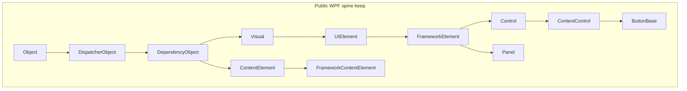

# AeroGUI-R SDK 结构与类层次重整方案

## 结论（先说判断）

本仓库的**产品边界已经比参考项目更干净**：`Aero::Gui` / `Aero::Render` / `Aero::App` / `Aero::Base` 分层、公开头白名单、`GetXxx`/`SetXxx`、constexpr DP、`Result`/`Checked` 双轨，这些都应保留。参考项目 [`C:\Projects\AeroGUI`](C:\Projects\AeroGUI) 是典型 Noesis 形状（`NsGui` 一类型一头文件、`IView`、`AddVisualChild`、Visual 坐标变换齐全），但对象更肥、反射更重。

**不要**把公开模型改成已否决的 Facet/ECS（见 [`docs/WPF_Facet_Pattern_Architecture_Whitepaper.md`](docs/WPF_Facet_Pattern_Architecture_Whitepaper.md)）。WPF 开发者需要的是熟悉的继承与虚函数；C++ 优化应发生在**对象布局、子节点存储、DP store、头文件切分**，而不是换一套公开类型系统。

对照当前树，原方案里 Visual 变瘦、坐标 API、`TryCast`、TabControl→Selector、Primitives 路径、一类型一头文件（Panel/Headered 族）**已经落地**。剩余结构性问题收成三件：

1. **仍有几处继承偏离会误导 WPF 开发者**：`Path : FrameworkElement` 而非 `Shape`；`VirtualizingPanel : Object` 而非 `Panel`；`AERO_DECLARE_TYPE(DependencyObject, Base::Object)` 跳过了 C++ 基类 `DispatcherObject`。
2. **头文件所有权没收完**：`Primitives::Selector` 仍声明在 [`ListBox.hpp`](include/Aero/Controls/ListBox.hpp)；`Shape`/`Rectangle`/`Ellipse`/`Path` 挤在 [`Shapes.hpp`](include/Aero/Shapes.hpp)；`Documents.hpp` 仍是聚合头。
3. **对象存储仍肥**：DP 条目三份 `Value`、`FrameworkElement` 内嵌 `ResourceDictionary`、Visual 上一串散落 bool——这是后续动画/虚拟化的真正瓶颈。



---

## 与参考项目 / WPF 的对照

| 维度 | 参考 AeroGUI | 本项目现状 | 建议 |
| --- | --- | --- | --- |
| Visual 命名空间 | `Aero::Visual`（扁平） | `Aero::Media::Visual` + 头在 [`Visual.hpp`](include/Aero/Visual.hpp) | **保持 Media 命名空间**（更贴近 WPF `System.Windows.Media.Visual`） |
| 子节点 | `AddVisualChild` + 虚 `GetVisualChild`，不在基类存两份列表 | **已落地**：虚 `GetVisualChild` + `AddVisualChild`，基类无双 Vector | 保持；确认 Panel/Decorator 自有存储是唯一数据源 |
| 坐标 API | `PointFromScreen` / `TransformToVisual` 齐全 | **已落地**（`IsAncestorOf` / `TransformToVisual` / `PointToScreen`） | 保持；不必先做 3D |
| 宿主 View | `IView` 接口 | 具体类 [`View`](include/Aero/View.hpp) | **保持具体类**（C++ 嵌入式更简单）；需要时再抽 `IView` 给多实现 |
| 头文件 | ~900 个 `NsGui/*.h` 一类型一文件 | Panel/Headered/Primitives 多数已拆；**剩余** `ListBox.hpp` 含 Selector、`Shapes.hpp` 含四形状、`Documents.hpp` 聚合 | 补完剩余拆分 + 门禁 |
| 向下转型 | 反射 `DynamicCast` | **已落地** [`TryCast.hpp`](include/Aero/TryCast.hpp)；AsXxx 虚函数已删 | 日常控件头应 `#include` TryCast，文档对照 WPF `as` |
| DP 标识 | 运行时 Register | `constexpr DependencyProperty<T>{"Name"}` | **保留**（C++ 相对 WPF 的明确优势） |
| 属性访问 | `Get/Set` | 同左 | **保留**；不引入属性代理对象 |

公开继承深度建议维持 WPF 形状（约 6–8 层）。这是 XAML/Style/Template 语义的一部分；用组合替代继承只会让 WPF 开发者无法把知识迁移过来。内部引擎已经走 `ElementTree` 服务中枢 + 热字段 + `Rare*`，这条路是对的。

参考工程是 **行为与公开类层次的黄金标准**，不是实现或模块边界的模板。应对齐的只剩：`Path : Shape`、`VirtualizingPanel : Panel`、一类型一头文件。**不要照搬：**

- `IView` / `GUI::CreateView` 单例集成层（本仓库 `Gui` + 具体 `View` 更清晰）
- `IUITreeNode` / `IComponentInitializer` 接口堆（逻辑树用 Helper + 虚枚举即可）
- `BaseButton` 拼写（WPF 是 `ButtonBase`，本仓库已用对）
- `Ns*` 头路径与全量运行时反射（`TypeClass` 装箱）
- `Freezable → Animatable → Timeline` 多一层；本仓库 `Timeline : Freezable` 可保留，动画能力走 DP/Storyboard，不必为对齐再插 `Animatable`
- 参考项目不完整的 Dispatcher：本仓库已有帧相位 `Dispatcher`，应继续强化，而不是退回“仅线程亲和”

---

## A. 类层次与对象布局（性能关键）

### A1. Visual 子节点模型（已完成，作基线）

当前 [`Visual.hpp`](include/Aero/Visual.hpp) 已是薄节点：虚 `GetVisualChildrenCount`/`GetVisualChild`、protected `AddVisualChild`/`RemoveVisualChild`、`GetLogicalParent()` 返回 `DependencyObject*`，基类不再存双 Vector。后续只做校验：

- Panel 的 `UIElementCollection`、Decorator 的单孩子指针是唯一存储，不要再偷偷加回基类列表。
- 逻辑子枚举继续允许 `Inline`/`Run` 等非 Visual DO。

### A2. 热/稀有字段再压一轮（不改公开 API）

已有 `UIElement::LayoutHot` + `Rare*`，继续：

- Visual 的 render 句柄/dirty 打成 **bitfield + packed ids**，bool 不要各占 1 字节散落。
- `FrameworkElement` 上内嵌的 `ResourceDictionary resources_` 改为 **lazy**（无局部资源则为空指针）；`FrameworkContentElement` 同样。
- `authoredTriggers_` / `authoredBehaviors_` / style prototype 向量移入 Rare 或模板会话。
- `TryCast<T>` 已在 [`TryCast.hpp`](include/Aero/TryCast.hpp)；不要把 AsXxx 虚函数加回来。

### A3. DP store 紧凑化（功能扩展的前置）

[`src/gui/internal/PropertyStore.hpp`](src/gui/internal/PropertyStore.hpp) 每条目同时持有 `localValue` + `inheritedValue` + `effectiveValue` 三个 `Value`（每个 inline 32B）+ 一堆 bool。普通 Local/Style 条目过肥。

建议（仅内部，ABI 已用 `void*` 隐藏）：

- 热条目：`MemberId` + packed origin/flags + **一个** effective `Value`。
- Local/Inherited/Animation/Expression 进 `StoredValueRare`（已有 rare 指针，把“三份 Value”也挪下去）。
- 后续再做 packed bit layout（文档已声明这是后续优化，现在可以排进本轮）。

这是后续动画、继承、虚拟化列表的真正瓶颈，比再叠一层 Facet 更有效。

### A4. 布局遍历的 C++ 优化（引擎侧，公开仍是虚函数）

公开继续 `MeasureOverride`/`ArrangeOverride`。引擎侧：

- dirty 列表用 **连续 index/handle 数组**（`ElementTree` 已有 handle），不要每次从 Visual 指针跳 Vector。
- 已知内置 Panel（Stack/Grid/Canvas）可用内部函数表或 `TypeId` 分发，**不要求**用户类型 CRTP。
- 不把布局状态从对象上拆走（子类 `sizeof` 需要热字段在对象上，这点 [`SOURCE_ARCHITECTURE.md`](docs/SOURCE_ARCHITECTURE.md) 已经说对了）。

---

## B. 继承与语义修正（WPF 上手度）

已完成、不再列入本轮：`TabControl : Selector`、Primitives 路径（声明在 `Controls/Primitives/`，根目录只留转发）、逻辑树 DO、Visual 坐标 API、`OnVisualChildrenChanged`、`TryCast`。

**仍会误导 WPF 开发者、应优先修：**

- **`Path`**：现为 `Path : FrameworkElement` 并自己重复 Fill/Stroke/Stretch（[`Shapes.hpp`](include/Aero/Shapes.hpp)）。改为 `Path : Shape`，只保留 `Data`；否则样式/模板里对 `Shape` 的 Setter 打不到 Path。
- **`VirtualizingPanel`**：现为 `Object` 上的附加属性所有者，`VirtualizingStackPanel : Panel, IScrollInfo`（[`VirtualizingStackPanel.hpp`](include/Aero/Controls/VirtualizingStackPanel.hpp)）。改为 WPF 形 `VirtualizingPanel : Panel`，VSP 再继承它。附加属性可继续挂在基类上；C++ 不必为了“省虚函数”把面板踢出视觉树。
- **`Selector` 头归属**：类已在 `Controls::Primitives`，声明却在 [`ListBox.hpp`](include/Aero/Controls/ListBox.hpp)。迁到 `Controls/Primitives/Selector.hpp`；`ListBoxItem` 独立头。`TabControl.hpp` 不应为了 Selector 去包含整个 ListBox。
- **元数据基类 vs C++ 基类**：`AERO_DECLARE_TYPE(DependencyObject, Base::Object)`，但 C++ 继承 `DispatcherObject`。`TryCast<DispatcherObject>`、XAML 类型链、自定义控件 `AERO_DECLARE_TYPE` 都会和真实继承不一致。改为 `AERO_DECLARE_TYPE(DependencyObject, DispatcherObject)`，并核对 DispatcherObject 是否已注册进 TypeId 链。
- **`View`**：保持具体 `Object`；不要加 `IView`。

不追求对齐的部分（明确不做）：

- CLR 属性语法、`dynamic_cast`、异常、STL 容器进 ABI。
- `UIElement` 上每个事件的 `virtual OnXxx` 全量镜像（C++ 用 routed handler + 少量关键虚函数即可；全量虚函数会把 vtable 再胀一圈）。
- FlowDocument / 3D / Printing。

---

## C. SDK 头文件与发现性（一类型一头文件）

现有规范 [`docs/spec/PUBLIC_HEADER_MODEL.md`](docs/spec/PUBLIC_HEADER_MODEL.md) 写了“每个公开类型一个声明所有者”，但物理文件没做到。这是 WPF/参考项目开发者找类型的第一痛点。

**已拆完（保持）：** Canvas/Dock/Wrap/UniformGrid、Viewbox、GroupBox/Label/Expander/TabItem/TabControl、ContentElement、VisualTreeHelper/LogicalTreeHelper、DependencyObject 类归位、Primitives 声明路径。

**还要拆（公开头，实现 cpp 仍可按族合并）：**

- [`ListBox.hpp`](include/Aero/Controls/ListBox.hpp) → `Primitives/Selector.hpp` + `ListBoxItem.hpp` + `ListBox.hpp`。
- [`Shapes.hpp`](include/Aero/Shapes.hpp) → `Shape` / `Rectangle` / `Ellipse` / `Path` 各一文件；伞头 `Shapes.hpp` 只做 include。
- [`Documents.hpp`](include/Aero/Documents.hpp) → 至少 `Documents/Inline.hpp` 一族；伞头可留。
- [`VirtualizingStackPanel.hpp`](include/Aero/Controls/VirtualizingStackPanel.hpp) → `VirtualizingPanel.hpp` 独立（与层次修正一起做）。
- [`UIElement.hpp`](include/Aero/UIElement.hpp)：事件标识留在类上，handler Descriptor 挪出头文件，减小编译扇出。
- [`Value.hpp`](include/Aero/Value.hpp)（仍标 `AERO_GUI_API`）→ 值类型进 `Aero::Base`/`AERO_BASE_API`；编解码进 Meta。
- [`Meta.hpp`](include/Aero/Meta.hpp) 保持专家面；日常 `Button.hpp` 不得间接吞下整份 Meta。`FrameworkElement.hpp` 已不再硬包含 `DrawingContext.hpp`，继续切断 Fonts/Transforms 若仅前向声明即可。
- 根目录 `Controls/ButtonBase.hpp` 等兼容转发可留一版；门禁应把它们标成 umbrella，不能当成声明所有者。

架构门禁 [`cmake/CheckArchitecture.cmake`](cmake/CheckArchitecture.cmake) 增加一条：**除伞头/`Primitives.hpp`/`Controls.hpp` 外，每个 `class AERO_*_API` 的拥有文件名 = 类型名。**

包含图目标：

```text
Button.hpp → ButtonBase.hpp → ContentControl.hpp → Control.hpp
  → FrameworkElement.hpp → UIElement.hpp → Visual.hpp → DependencyObject.hpp
```

中间不再经过 `DrawingContext.hpp` / 全量 Animation / 全量 Meta。`OnRender` 的 `DrawingContext` 用前向声明即可。

---

## D. C++ 便利层（给 WPF 开发者，但不假装是 C#）

在不引入 CLR 的前提下，统一这几条惯例（写进 [`docs/WPF_QUICK_START.md`](docs/WPF_QUICK_START.md) 并在头文件落实）：

- 属性：`GetFoo` / `SetFoo` / `ClearFoo`；附加属性：`Grid::SetRow(element, 1)`。
- 失败：WPF 形 `void` 方法 + `*Checked`；不要在 `SetWidth` 上返回 `Result`。
- 事件：`button->Click() += handler;` 保持；不增加宏版 `CLICK(button)`。
- 转型：`Aero::TryCast<Controls::Button>(obj)`，文档里对照 WPF `as` / Noesis `DynamicCast`。
- 工厂：`Base::MakeRef<Button>()`；控件构造函数继续 `TypeId` 保护 + 公有默认构造。
- XAML：继续 `Gui::LoadXaml<T>` / `LoadComponent`；这已经比参考项目的 GUI 单例更清晰。
- 自定义控件作者：一个最小 `#include <Aero/Meta.hpp>` 路径注册 DP；日常应用代码零 Meta。

---

## E. 实施顺序（建议分 4 个可合并的提交波次）

波次之间保持可编译；都是预 1.0 允许的破坏性变更。

1. **剩余头文件 + 门禁**：Selector/ListBoxItem/Shapes/Documents/VirtualizingPanel 一类型一头文件。
2. **剩余层次语义**：Path→Shape；VirtualizingPanel→Panel；DependencyObject 元数据基类对齐 DispatcherObject。
3. **存储压缩**（最大剩余性能收益）：DP 条目瘦身、ResourceDictionary lazy、flags packed。不改公开签名。

波次 1–2 可同一 PR；波次 3 独立，避免和类型搬迁缠在一起。

明确不在本轮做：复活 Facet；引入 `IView`；把 `View` 做成 `DispatcherObject` 子类（它是宿主对象，不是 DO 树节点）；D3D12/Vulkan。

---

## 关键文件

- 公开脊柱：[`include/Aero/Visual.hpp`](include/Aero/Visual.hpp)、[`DependencyObject.hpp`](include/Aero/DependencyObject.hpp)、[`TryCast.hpp`](include/Aero/TryCast.hpp)
- 待修层次：[`Shapes.hpp`](include/Aero/Shapes.hpp)、[`Controls/ListBox.hpp`](include/Aero/Controls/ListBox.hpp)、[`Controls/VirtualizingStackPanel.hpp`](include/Aero/Controls/VirtualizingStackPanel.hpp)
- 内核：[`src/gui/internal/PropertyStore.hpp`](src/gui/internal/PropertyStore.hpp)、[`docs/SOURCE_ARCHITECTURE.md`](docs/SOURCE_ARCHITECTURE.md)、[`docs/spec/PUBLIC_HEADER_MODEL.md`](docs/spec/PUBLIC_HEADER_MODEL.md)
