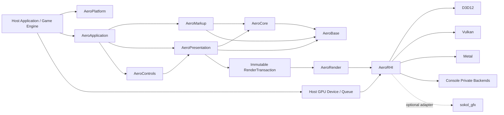

# AeroGUI

> 一个面向 C++17 的、跨平台的 WPF/XAML 语义运行时与原生 GPU UI 引擎。  
> A clean-room, cross-platform WPF-style XAML runtime and native GPU UI engine for C++17.

[](#项目状态)
[](#技术基线)
[](#原生-gpu-渲染)
[](LICENSE)

AeroGUI 的目标不是搬运 Windows WPF 二进制，也不是复制 NoesisGUI、Moonlight 或其他产品的内部实现。项目以 **WPF 的公开行为与 XAML 语义**为主要兼容基准，采用 clean-room 方法，以 C++17 自主实现对象系统、属性系统、XAML、布局、绑定、控件和原生 GPU 渲染器。

本仓库当前处于 **architecture-first / specification-first** 阶段。实现应遵循 [`docs/WPF_CPP_PORT_SPEC.md`](docs/WPF_CPP_PORT_SPEC.md)，重大决策由 [`docs/adr`](docs/adr) 中的 Accepted ADR 固化。

## 已确定的技术方向

- Runtime、工具和测试统一使用 **C++17**；项目不要求也不采用 C++20。
- 采用轻量、自有的 `AeroBase` 基础设施，包括 allocator、UTF-8 String、容器、Result 和 intrusive 引用计数指针。
- Runtime 公共 ABI 不暴露 STL 容器、异常、RTTI、协程或编译器专有类型。
- 采用类似 NoesisGUI 产品定位的 **高性能、可嵌入、保留模式、原生 GPU UI 引擎**，但实现完全独立。
- 生产渲染不使用 Skia；核心图形抽象为自有 `AeroRHI`。
- 第一方正式后端目标为 D3D12、Vulkan、Metal，以及受限仓库中的游戏主机后端。
- `sokol_gfx` 只允许作为可选 bring-up、样例或兼容适配器，不能成为核心 RHI、唯一渲染后端或主机平台方案。
- FreeType、HarfBuzz、Expat、libtess2、Ryu 均通过私有 provider/adapter 边界可选集成，不允许第三方类型泄漏到公共 API。

## 设计来源

AeroGUI 只吸收公开、可观察的通用设计经验：

- **WPF**：Dependency Property、逻辑树/视觉树、Measure/Arrange、Routed Event、Binding、Resource、Style 与 Template 的语义。
- **Moonlight**：跨平台原生 runtime、宿主边界和可替换渲染后端的历史经验。
- **NoesisGUI**：轻量 C++ 对象模型、intrusive 引用计数、保留模式视觉/渲染结构、宿主集成和原生 GPU UI 的公开架构思路。

禁止复制、反编译或提交 NoesisGUI 私有实现；Moonlight 源码也不会默认并入项目。公开文档只能用于理解架构概念，具体数据结构、算法、API 和实现由 AeroGUI 独立设计。

## 项目目标

1. **WPF 语义优先**  
   对已声明支持的功能，保证属性优先级、布局、资源查找、事件路由和绑定更新行为可测试、可诊断。

2. **C++17 与可嵌入**  
   核心不依赖 CLR。宿主拥有窗口、线程、事件循环、文件系统、GPU device、queue 和 frame scheduling。

3. **原生 GPU 渲染**  
   生产绘制通过 D3D12、Vulkan、Metal 或专有主机 API 执行。AeroGUI 不依赖 Skia 或软件 compositor。

4. **稳定的宿主边界**  
   支持源码集成、静态库和平台二进制 SDK；跨动态模块边界优先使用 opaque handle、POD、StringView、Span 和版本化 C function table。

5. **可控内存与性能**  
   基础容器使用宿主可注入 allocator、memory tag、显式容量和无异常错误路径。所有热点必须可追踪和基准化。

6. **渐进兼容**  
   先实现可测试的 WPF 子集，再扩展 Controls、动画、复杂文本、无障碍和设计工具。未支持功能不得静默降级。

## 非目标

首个稳定版本不承诺：

- WPF/.NET 二进制、ABI 或 C# 源码兼容；
- BAML 兼容；
- FlowDocument、XPS、Printing、MediaElement、WPF 3D 或浏览器插件模型；
- 首次发布即覆盖全部 WPF 控件和边缘行为；
- 使用 C++20、Modules、Ranges、Coroutines 或 C++20 标准库作为实现基础；
- 使用 Skia 作为 reference、fallback 或生产 renderer；
- 复制 WPF、Moonlight 或 NoesisGUI 的内部代码。

## 架构概览



## AeroBase 基础设施

Runtime 不以 STL 类型作为公共数据模型。`AeroBase` 至少提供：

```text
Allocator / MemoryTag / OutOfMemoryHandler
String / StringView / Utf8Iterator
Vector<T> / SmallVector<T, N> / Span<T>
HashMap<K, V> / HashSet<T>
Optional<T> / Result<T> / Variant
Ref<T> / WeakRef<T> / Unique<T>
Delegate / Subscription / Handle
```

规则：

- `String` 的规范编码为 UTF-8；UTF-16 仅存在于平台桥接和显式转换边界。
- `Vector`、`HashMap`、`HashSet` 使用显式 allocator，不依赖异常处理分配失败。
- `Collection<T>` 是 Presentation 层的可观察集合语义，不等同于底层动态数组。
- `Ref<T>` / `WeakRef<T>` 用于 `Object` 派生类型；不使用名称含糊且与旧标准库冲突的 `AutoPtr`。
- STL 算法和私有实现可在不穿越 ABI、且不破坏构建约束时使用；工具和测试可以更自由地使用 STL。

详细合同见 [`docs/spec/FOUNDATION_ABI.md`](docs/spec/FOUNDATION_ABI.md)。

## 运行时结构

AeroGUI 同时维护四种相关但职责不同的结构：

| 结构 | 主要用途 |
| --- | --- |
| Object graph | C++ 对象所有权与一般引用关系 |
| Logical tree | 内容模型、DataContext/属性继承、资源查找 |
| Visual tree | 布局、命中测试、事件路由和模板视觉结构 |
| Render tree | 面向渲染域的紧凑场景数据，不包含用户对象指针 |

典型帧流程：

```text
Pump platform events
 -> Dispatch input and commands
 -> Update bindings and animations
 -> Measure / Arrange
 -> Build immutable RenderTransaction
 -> Apply transaction in render domain
 -> Build native GPU passes and batches
 -> Record commands into host command stream
 -> Submit / present by host policy
```

UI 线程之外不得读写可变 UI 对象。渲染域只接收不可变事务、稳定 ID、资源句柄和显式同步信息。

## 原生 GPU 渲染

`AeroRender` 负责 retained render tree、scene diff、clip/effect plan、批次、glyph/image/geometry cache；`AeroRHI` 只负责资源、pipeline、pass、command encoding 和同步抽象。

正式后端：

| 后端 | 主要平台 |
| --- | --- |
| `AeroRHI_D3D12` | Windows、Xbox/GDK adapter |
| `AeroRHI_Vulkan` | Windows、Linux、Android |
| `AeroRHI_Metal` | macOS、iOS、iPadOS、tvOS |
| `AeroRHI_ConsolePrivate` | 授权主机 SDK 的受限实现 |
| `AeroRHI_Null` | headless 验证、事务和资源生命周期测试 |

生产 renderer 不支持 Skia。为了 headless/golden 测试，项目可实现受限、自有、确定性的 CPU reference rasterizer，但它不是产品绘制后端。

### sokol 的定位

`sokol_gfx` 可以通过 `AeroRHI_Sokol` 作为可选 adapter，用于：

- 早期桌面/移动 bring-up；
- 示例、WebAssembly 实验和开发工具；
- D3D11、Metal、GL/GLES 或 WebGPU 环境中的兼容验证。

它不能：

- 定义 `AeroRHI` 公共 API；
- 成为 D3D12、Vulkan、Metal 和主机 backend 的共同最低层；
- 替代专有游戏主机后端；
- 让 `sokol_app` 接管嵌入式 runtime 的窗口、输入或主循环。

## 可选第三方库

所有依赖都必须可替换、可禁用、可锁定版本，并通过 AeroGUI 私有 adapter 使用：

| 库 | 用途 | 推荐策略 |
| --- | --- | --- |
| FreeType | 字体文件访问、outline、hinting、glyph raster | 通用平台默认 provider；可由平台/宿主字体服务替换 |
| HarfBuzz | OpenType/AAT shaping | 完整复杂文本 capability 的默认 provider；关闭时只声明有限文本能力 |
| Expat | 流式 XML tokenization | Runtime XAML 的默认候选；compiled-XAML-only 或宿主 parser 配置可关闭 |
| libtess2 | CPU path tessellation | 实验性、可替换 fallback；必须封装、fuzz 并评估维护状态 |
| Ryu | 确定性 float-to-string | 推荐用于 XAML/诊断/序列化；可由经过一致性验证的实现替换 |
| sokol | 可选 RHI adapter/样例 | 默认关闭，不进入核心依赖图 |

详细策略见 [`docs/THIRD_PARTY.md`](docs/THIRD_PARTY.md)。

## 技术基线

- ISO C++17，`CXX_EXTENSIONS OFF`；
- CMake + CTest；
- Visual Studio 2026 / MSVC `/std:c++17` 作为 Windows 主工具链；
- Clang 与 GCC 作为持续跨平台工具链；
- Windows x64 为首个 bring-up 平台，随后是 Android、Linux、macOS/iOS；
- Runtime 公共 API 不抛异常、不依赖 C++ RTTI；
- CI 必须覆盖 exceptions-off、RTTI-off、dependency-off 组合；
- 默认无隐藏线程；
- 所有跨线程数据必须是不可变值、冻结资源或显式同步句柄；
- shader 使用离线编译与平台包，发行版不得要求运行时 shader JIT。

## 计划目录

```text
AeroGUI/
├── include/Aero/{Base,Core,Markup,Presentation,Controls,Render,Platform}
├── src/{base,core,markup,presentation,controls,render,platform}
├── backends/
│   ├── rhi_d3d12/
│   ├── rhi_vulkan/
│   ├── rhi_metal/
│   ├── rhi_null/
│   ├── rhi_sokol/          # optional
│   ├── console_private/    # restricted SDK repositories
│   └── platform_{win32,android,apple,linux}/
├── third_party/            # manifests/patches; source policy in docs
├── tools/{xamlc,shaderpack,inspector}/
├── tests/{unit,conformance,golden,layout,render,fuzz,perf}/
├── samples/
├── docs/{adr,spec}/
└── LICENSE
```

## 路线图

### M0 — Architecture baseline

- 固化 C++17、Foundation、ABI、RHI 和第三方依赖 ADR；
- 建立 dependency manifest、NOTICE、CI 和 capability manifest。

### M1 — Foundation 与 Core

- allocator、String、Vector、HashMap、HashSet；
- intrusive `Ref<T>` / `WeakRef<T>`；
- TypeRegistry、Dispatcher、DependencyProperty；
- exceptions-off / RTTI-off / sanitizer 测试。

### M2 — XAML、布局与第一条 GPU 垂直切片

- 流式 XML/XAML node pipeline；
- Visual/UIElement/FrameworkElement；
- Canvas、StackPanel、Grid、Border、TextBlock；
- `RenderTransaction`、`AeroRHI_Null` 与一个原生 GPU backend；
- XAML → layout → GPU image 全链路。

### M3 — 应用模型与多平台 GPU

- Binding、Resource、Style、Template、Controls；
- D3D12、Vulkan、Metal 中至少两个后端；
- FreeType/HarfBuzz text pipeline；
- Android 与 iOS 集成样例。

### M4 — Production runtime

- UI/render 双线程事务；
- clip、mask、offscreen、effect、atlas、虚拟化；
- 三个公开原生 GPU 后端和主机 adapter 合同；
- IME、accessibility、inspector、性能与长期稳定性门禁。

## 设计与规格

- [`docs/WPF_CPP_PORT_SPEC.md`](docs/WPF_CPP_PORT_SPEC.md)
- [`docs/spec/FOUNDATION_ABI.md`](docs/spec/FOUNDATION_ABI.md)
- [`docs/spec/CORE_RUNTIME.md`](docs/spec/CORE_RUNTIME.md)
- [`docs/spec/XAML_PRESENTATION.md`](docs/spec/XAML_PRESENTATION.md)
- [`docs/spec/RENDERING_PLATFORM.md`](docs/spec/RENDERING_PLATFORM.md)
- [`docs/spec/QUALITY_ROADMAP.md`](docs/spec/QUALITY_ROADMAP.md)
- [`docs/THIRD_PARTY.md`](docs/THIRD_PARTY.md)

## Clean-room 与许可证

AeroGUI 使用 Apache License 2.0。兼容性工作只能基于公开规范、公开文档、自己编写的行为测试和可观察结果。禁止提交 NoesisGUI 私有 SDK 源码、反编译结果、受 NDA 限制材料、专有 shader 或私有序列化格式。

第三方库必须记录来源、固定版本或提交、许可证、NOTICE、补丁、构建选项、安全更新策略和可替代 provider。