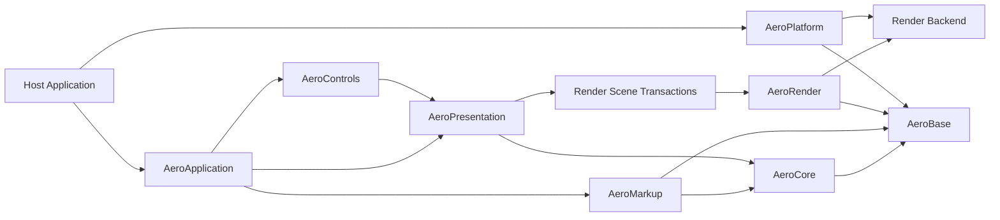

# AeroGUI

> 一个面向 C++20 的、跨平台的 WPF/XAML 语义运行时。  
> A clean-room, cross-platform WPF-style XAML UI runtime for native C++.

[](#项目状态)
[](#技术基线)
[](LICENSE)

AeroGUI 的目标不是把 Windows WPF 二进制搬到其他平台，也不是复刻某个商业引擎的内部实现；它要以 **WPF 的公开行为与 XAML 语义为兼容基准**，使用现代 C++ 重建一套可嵌入、可测试、可替换渲染后端的 UI 运行时。

本仓库当前处于 **architecture-first / specification-first** 阶段。实现应以 [`docs/WPF_CPP_PORT_SPEC.md`](docs/WPF_CPP_PORT_SPEC.md) 为基线，并通过 ADR 记录重大偏离。

## 设计来源

AeroGUI 综合吸收三类公开设计经验：

- **WPF**：Dependency Property、逻辑树/视觉树、Measure/Arrange、Routed Event、Binding、Resource、Style 与 Template 的可观察语义。
- **Moonlight**：跨平台原生运行时、宿主集成边界和可替换渲染后端的历史经验。
- **NoesisGUI**：轻量 C++ 对象模型、保留模式视觉/渲染树、UI 线程与渲染线程隔离，以及由宿主掌控线程和设备生命周期的集成方式。

WPF 的公开文档是兼容行为的主要依据。Moonlight 仅作为历史架构参考；NoesisGUI 仅参考公开文档。项目采用 clean-room 实现，不复制、反编译或移植 NoesisGUI 的私有代码，也不直接并入 Moonlight 源码。

## 项目目标

1. **WPF 语义优先**  
   对已声明支持的功能，优先保证属性优先级、布局、资源查找、事件路由和绑定更新等行为可预测。

2. **原生 C++ 与可嵌入**  
   核心不依赖 CLR。宿主负责窗口、线程、输入、文件系统和 GPU 设备；AeroGUI 不在后台偷偷创建线程。

3. **平台与渲染解耦**  
   UI 对象树、布局、输入和绑定不依赖具体图形 API。渲染端通过稳定的场景事务和后端接口工作。

4. **性能可度量**  
   保留模式渲染、增量失效、批量场景提交、资源缓存和虚拟化均应有基准与预算，而不是依赖不可验证的“高性能”描述。

5. **渐进兼容**  
   先实现可测试的 WPF 子集，再扩展 Controls、动画、文本、无障碍和工具链。未支持功能必须给出明确诊断，禁止静默降级。

## 非目标

首个稳定版本不承诺：

- WPF/.NET 的二进制或 ABI 兼容；
- BAML 文件兼容；
- `System.Windows.*` C# 源码直接编译；
- 完整实现 FlowDocument、XPS、Printing、MediaElement、WPF 3D 或浏览器插件模型；
- 对所有 WPF 控件和边缘行为一次性达到完全兼容；
- 复制 Moonlight、WPF 或 NoesisGUI 的内部实现。

## 架构概览



### 核心对象层次

```text
Object
└── DispatcherObject
    └── DependencyObject
        ├── Freezable
        └── Visual
            └── UIElement
                └── FrameworkElement
                    ├── Control
                    ├── Panel
                    └── Decorator
```

这个层次表达职责边界，而不是要求逐字复制 WPF 或 NoesisGUI 的类实现。

## 运行时模型

AeroGUI 同时维护四种相关但职责不同的结构：

| 结构 | 主要用途 |
| --- | --- |
| Object graph | C++ 对象所有权与一般引用关系 |
| Logical tree | 内容模型、DataContext/属性继承、资源查找 |
| Visual tree | 布局、命中测试、事件路由和模板生成的视觉结构 |
| Render tree | 面向渲染线程的紧凑场景数据，不暴露用户对象指针 |

每帧的典型流程：

1. 宿主泵入平台事件；
2. UI Dispatcher 执行输入、命令、绑定和动画更新；
3. 处理属性失效与 Measure/Arrange；
4. 把视觉变化压缩为不可变的 `RenderTransaction`；
5. 渲染线程应用事务并构建绘制批次；
6. 执行离屏 pass、主 framebuffer pass，并提交 GPU 工作。

UI 线程之外不得读取或修改 UI 对象。渲染线程只能访问场景快照、资源句柄和稳定 ID。

## 模块

| 模块 | 职责 |
| --- | --- |
| `AeroBase` | 类型、结果、诊断、内存、字符串、URI、集合和公共基础设施 |
| `AeroCore` | Dispatcher、反射、Dependency Property、Expression、事件基础 |
| `AeroMarkup` | XAML tokenizer/parser、schema、object writer、markup extension、编译 XAML IR |
| `AeroPresentation` | Visual/UIElement/FrameworkElement、树、布局、输入、资源、绑定、样式和模板 |
| `AeroControls` | Control、ContentControl、ItemsControl、Panel 与标准控件 |
| `AeroRender` | Render tree、场景事务、绘制列表、缓存、文本/图像资源和后端接口 |
| `AeroPlatform` | 窗口、指针、键盘、IME、剪贴板、文件、计时器、DPI 与无障碍桥接 |
| `AeroXamlCompiler` | XAML 校验、依赖收集和可选 AOT 工厂生成 |
| `AeroTestKit` | WPF 行为探针、golden XAML、布局快照、像素比较和 fuzz harness |

模块依赖必须保持有向无环。`Core` 不依赖 `Presentation`，`Presentation` 不依赖具体平台和 GPU API。

## WPF 兼容级别

AeroGUI 采用显式 capability 模型：

- **Core**：类型系统、Dependency Property、Dispatcher、诊断；
- **Markup**：基础 XAML、attached property、NameScope、markup extension；
- **Presentation**：树、资源、Binding、Measure/Arrange、Routed Event；
- **Controls**：样式、模板、基础控件、ItemsControl；
- **Advanced**：动画、虚拟化、复杂文本、无障碍、设计时工具。

一个 XAML 文档只能在其所需 capability 全部可用时通过加载或编译。对未知类型、未知成员、无效属性值、循环资源和不受支持的 markup extension，加载器必须返回带源位置的诊断。

## 技术基线

- C++20；
- CMake + CTest；
- Windows x64 为首个 bring-up 平台；
- Linux x64 为第二平台，macOS arm64 为第三平台；
- UI 层与渲染后端分离；
- 默认无隐藏线程；
- 公共边界优先使用 `Result<T>` 与结构化诊断；
- 编译期开关决定异常、RTTI 和特定后端；
- AddressSanitizer、UndefinedBehaviorSanitizer、ThreadSanitizer 和静态分析进入 CI；
- 所有跨线程数据必须是不可变值、冻结资源或显式同步的句柄。

## 计划中的目录

```text
AeroGUI/
├── CMakeLists.txt
├── cmake/
├── include/Aero/
│   ├── Base/
│   ├── Core/
│   ├── Markup/
│   ├── Presentation/
│   ├── Controls/
│   ├── Render/
│   └── Platform/
├── src/
│   ├── base/
│   ├── core/
│   ├── markup/
│   ├── presentation/
│   ├── controls/
│   ├── render/
│   └── platform/
├── backends/
│   ├── render_skia/
│   ├── window_win32/
│   └── window_sdl/
├── tools/
│   └── xamlc/
├── tests/
│   ├── unit/
│   ├── conformance/
│   ├── golden/
│   ├── render/
│   └── fuzz/
├── samples/
├── docs/
│   ├── adr/
│   └── WPF_CPP_PORT_SPEC.md
└── LICENSE
```

目录是设计目标；在对应里程碑开始前不需要创建空目录。

## 路线图

### M0 — Architecture baseline

- 固化本 README 与详细规格；
- 建立 ADR、贡献规范和 CI 骨架；
- 定义 compatibility manifest 与诊断格式。

### M1 — Core object/property runtime

- intrusive `Ref<T>` / `WeakRef<T>`；
- TypeRegistry 与确定性注册；
- DispatcherObject 与 UI 线程亲和性；
- DependencyProperty、metadata、effective value 和失效传播；
- 属性优先级与生命周期单元测试。

### M2 — XAML + layout vertical slice

- 流式 XAML 解析与 object writer；
- NameScope、attached property、StaticResource；
- Visual/UIElement/FrameworkElement；
- Canvas、StackPanel、Grid、Border、TextBlock；
- Measure/Arrange 与布局快照测试；
- 单窗口参考渲染后端。

### M3 — Binding + styles + controls

- DataContext、BindingExpression 和通知接口；
- DynamicResource；
- Style、ControlTemplate、DataTemplate；
- Button、ContentControl、ItemsControl、ListBox、ScrollViewer；
- Routed Event、焦点、输入捕获和命令。

### M4 — Production runtime

- UI/render 双线程事务；
- GPU 缓存、离屏 pass、文本图集和图像生命周期；
- 动画、虚拟化、复杂文本、IME；
- 无障碍平台桥；
- 性能与兼容回归门禁。

## 最小示例（目标 API）

```cpp
#include <Aero/Application.hpp>
#include <Aero/Markup/XamlReader.hpp>

int main()
{
    Aero::Application app;

    auto window = Aero::Markup::XamlReader::Load<Aero::Window>(
        R"(
        <Window
            xmlns="http://schemas.microsoft.com/winfx/2006/xaml/presentation"
            xmlns:x="http://schemas.microsoft.com/winfx/2006/xaml"
            Title="AeroGUI">
          <Grid>
            <Button
                HorizontalAlignment="Center"
                VerticalAlignment="Center"
                Content="{Binding Greeting}" />
          </Grid>
        </Window>)");

    if (!window)
    {
        Aero::Diagnostics::Write(window.error());
        return 1;
    }

    return app.Run(*window);
}
```

该 API 仅用于确定设计方向，不代表当前仓库已经提供可构建实现。

## 设计与规格

详细的架构约束、行为契约、里程碑验收条件和测试策略见：

- [`docs/WPF_CPP_PORT_SPEC.md`](docs/WPF_CPP_PORT_SPEC.md)

重大架构变化必须新增 ADR，并在规格的“已决策事项”中引用。

## Clean-room 与许可证

AeroGUI 使用 Apache License 2.0。兼容性工作必须基于：

- 公开规范和公开文档；
- 自己编写的行为测试；
- 在 Windows 上运行 WPF 样例得到的可观察结果；
- 不受限制的通用算法与独立实现。

禁止把 NoesisGUI SDK 的私有实现、反编译结果或受限材料提交到仓库。Moonlight 源码受其自身许可证约束；任何源码级复用都必须在独立法律审查、NOTICE 和依赖隔离后进行，默认方案是不复用其代码。

## 参考资料

- WPF architecture: <https://learn.microsoft.com/dotnet/desktop/wpf/advanced/wpf-architecture>
- WPF dependency properties: <https://learn.microsoft.com/dotnet/desktop/wpf/properties/dependency-properties-overview>
- WPF layout: <https://learn.microsoft.com/dotnet/desktop/wpf/advanced/layout>
- WPF trees: <https://learn.microsoft.com/dotnet/desktop/wpf/advanced/trees-in-wpf>
- WPF data binding: <https://learn.microsoft.com/dotnet/desktop/wpf/data/>
- Moonlight overview: <https://www.mono-project.com/docs/web/moonlight/>
- Moonlight 4 rendering notes: <https://www.mono-project.com/archived/release_notes_moonlight4_preview/>
- NoesisGUI architecture: <https://www.noesisengine.com/docs/Gui.Core.Architecture.html>
- NoesisGUI rendering architecture: <https://www.noesisengine.com/docs/Gui.Core.RenderingTutorial.html>
- NoesisGUI dependency system: <https://www.noesisengine.com/docs/Gui.DependencySystem.Index.html>
