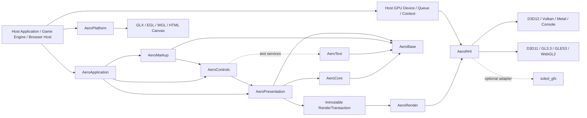

# AeroGUI

> 一个面向 C++17 的、跨平台的 WPF/XAML 语义运行时与原生 GPU UI 引擎。  
> A clean-room, cross-platform WPF-style XAML runtime and native GPU UI engine for C++17.

[](#项目状态)
[](#技术基线)
[](#原生-gpu-渲染)
[](#浏览器与-webgl-2)
[](LICENSE)

AeroGUI 的目标不是搬运 Windows WPF 二进制，也不是复制 NoesisGUI、Moonlight 或其他产品的内部实现。项目以 **WPF 的公开行为与 XAML 语义**为主要兼容基准，采用 clean-room 方法，以 C++17 自主实现对象系统、属性系统、XAML、布局、绑定、控件和原生 GPU 渲染器。

本仓库当前处于 **runtime vertical slice** 阶段。架构基线、C++17 runtime、metadata-driven XAML、Binding/DataContext、Style/Template、compiled XAML、D3D11/WARP 垂直切片和模块 SDK 已落地主线；当前 M3.5 聚焦文本栈、交互控件、滚动/Items、OpenGL 3.3 与真实 ControlGallery。实现应遵循 [`docs/WPF_CPP_PORT_SPEC.md`](docs/WPF_CPP_PORT_SPEC.md)，重大决策由 [`docs/adr`](docs/adr) 中的 Accepted ADR 固化。

## 项目状态

- 主线基线：M0/M1 完成，M2 的 runtime XAML → layout → D3D11 垂直切片可构建并有自动化测试。
- 已完成的 M3 基础：Binding/DataContext、通知驱动更新、Style/ControlTemplate/TemplateBinding/property trigger、compiled XAML document、module SDK 和 `aero-xamlc`。
- 当前阶段：**M3.5 — Interactive Controls, Text and OpenGL Vertical Slice**。
- compiled document encoding 固定为 v1，compiled cache format 固定为 v7；`aero-xamlc --check` smoke test 已纳入 CTest，并由正式 CI 执行。
- 已建立 `AeroText` 的 provider-neutral 合同层，并完成可独立裁剪的 FreeType provider、HarfBuzz shaper、code-point coverage 查询与显式 fallback face 链分段、provider-neutral glyph atlas、`TextLayout::ShapeAndMeasure` 基础排版、TextBlock 自动布局服务 seam，以及 atlas-backed RHI 上传/注册和 fence 延迟回收；固定字体测试覆盖 Latin、数字、中文、Arabic、跨字体 fallback、稳定测量、word/character wrapping、ellipsis trimming、水平对齐、行高、glyph metrics、Gray8 raster、outline、DPI、face cache/lifetime、atlas page/shelf、fence-safe reuse 和 device-loss generation，TextBlock 测试覆盖多 atlas batch、文本变更、DPI 重排，并由真实 Roboto/Mplus + FreeType/HarfBuzz 字体通过 D3D11/WARP 像素门禁。
- 已完成交互/集合基础切片：Command、统一 hover/pressed/focus/capture 状态、键盘焦点导航、setter-based VisualStateManager、Button/RepeatButton、ToggleButton/CheckBox/RadioButton、Generic/Light/Dark 主题、ScrollViewer/ScrollBar、ItemsControl/container generator、Selector/ListBox，以及带 realization window、overscan、recycling 和 10k benchmark 的 VirtualizingStackPanel。
- 已完成 OpenGL 3.3 基础合同、RHI 及 Windows/WGL、Linux/X11/GLX 实现切片：host-injected function table、3.3 Core Profile/当前线程/context generation 验证、capability/limits 查询、完整 state cache，以及 buffer、texture、sampler、GLSL 330 pipeline、render pass、bind/draw、GLsync、readback 和外部导入；WGL/GLX adapter 支持 owned/borrowed context、native surface 配置、swap interval、resize、present 和 context recreation，并由 hidden-window 真 Core 3.3 绘制/present conformance 覆盖。`AeroRenderOpenGL33` 复用 backend-neutral `Renderer` 完成 RenderPlan lowering；D3D11/WARP、WGL 和 GLX 运行同一计划 hash、rectangle/image/mesh/glyph fixture 与像素容差门禁，borrowed GL context 另有真实 host-state 恢复验证。
- 已完成独立 UTF-8 可编辑文本模型：gap buffer 避免逐次输入复制全文，公共位置统一使用 grapheme cluster 索引，并覆盖 caret/selection、range replacement、undo/redo、最大长度、只读模式、行模型和 UTF-8 边界诊断。
- 已完成 TextBox 与剪贴板切片：`Text` 默认 TwoWay、UTF-8 文本输入、selection/caret 绘制、指针拖选、键盘导航与编辑、undo/redo、平台中立剪贴板、Win32 `CF_UNICODETEXT`、独立密码显示/复制策略，以及 `IScrollInfo`/ScrollViewer 接入均已有跨平台测试。
- 已完成平台中立 IME host seam 与 Win32 Imm32 adapter：支持 composition 开始、预编辑、提交、取消和 DPI-aware candidate window；预编辑不会提前写回 Binding source，失焦、禁用、只读、宿主切换和控件销毁均安全终止 composition。
- 已完成真实 `ControlGallery` 应用：同一份 XAML 支持 runtime/compiled 两条加载路径与等价性校验，覆盖 Light/Dark、基础控件、Binding、自定义模块和 10k recycling virtualization；Windows 可切换 D3D11/WARP 与 OpenGL 3.3/WGL，Linux 使用 OpenGL 3.3/GLX，并为两类原生后端提供 context/device-loss 恢复 smoke。
- 尚未完成：完整 Unicode line breaking/bidi 与最终性能/稳健性门禁。TextBlock 渲染服务已支持在 loss 后放弃旧 handles、重绑定宿主重建的 device/backend，并由下一次布局重建 atlas 与 glyph runs。

## 已确定的技术方向

- Runtime、工具和测试统一使用 **C++17**；项目不要求也不采用 C++20。
- 采用轻量、自有的 `AeroBase` 基础设施，包括 allocator、UTF-8 String、容器、Result 和 intrusive 引用计数指针。
- Runtime 公共 ABI 不暴露 STL 容器、异常、RTTI、协程或编译器专有类型。
- 采用类似 NoesisGUI 产品定位的 **高性能、可嵌入、保留模式、原生 GPU UI 引擎**，但实现完全独立。
- 生产渲染不使用 Skia；核心图形抽象为自有 `AeroRHI`。
- 战略后端：D3D12、Vulkan、Metal 和受限仓库中的游戏主机后端。
- 正式兼容后端：D3D11、OpenGL 3.3 Core、OpenGL ES 3.0、WebGL 2。
- GLX、EGL、WGL 是 Platform 层的 context/surface adapter，不是绘制后端。
- WebGL 1 不进入 v1，也不作为 WebGL 2 的静默 fallback。
- `sokol_gfx` 只作为可选 bring-up、样例或并行验证适配器，不能成为核心 RHI、唯一渲染后端或主机平台方案。
- FreeType、HarfBuzz、Expat、libtess2、Ryu 均通过私有 provider/adapter 边界可选集成，不允许第三方类型泄漏到公共 API。

## 设计来源

AeroGUI 只吸收公开、可观察的通用设计经验：

- **WPF**：Dependency Property、逻辑树/视觉树、Measure/Arrange、Routed Event、Binding、Resource、Style 与 Template 的语义。
- **Moonlight**：跨平台原生 runtime、宿主边界和可替换渲染后端的历史经验。
- **NoesisGUI**：轻量 C++ 对象模型、intrusive 引用计数、保留模式视觉/渲染结构、宿主集成和原生 GPU UI 的公开架构思路。

禁止复制、反编译或提交 NoesisGUI 私有实现；Moonlight 源码也不会默认并入项目。公开文档只能用于理解架构概念，具体数据结构、算法、API、shader 和实现由 AeroGUI 独立设计。

## 项目目标

1. **WPF 语义优先**  
   对已声明支持的功能，保证属性优先级、布局、资源查找、事件路由和绑定更新行为可测试、可诊断。

2. **C++17 与可嵌入**  
   核心不依赖 CLR。宿主拥有窗口、线程、事件循环、文件系统、GPU device、queue 和 frame scheduling。

3. **原生 GPU 渲染**  
   产品绘制通过 D3D12、D3D11、Vulkan、Metal、OpenGL、OpenGL ES、WebGL 2 或专有主机 API 执行。AeroGUI 不依赖 Skia 或软件 compositor。

4. **稳定的宿主边界**  
   支持源码集成、静态库和平台二进制 SDK；跨动态模块边界优先使用 opaque handle、POD、StringView、Span 和版本化 C function table。

5. **可控内存与性能**  
   基础容器使用宿主可注入 allocator、memory tag、显式容量和无异常错误路径。所有热点必须可追踪和基准化。

6. **跨桌面、移动、主机与 Web**  
   同一 XAML、layout 和 RenderPlan 语义覆盖 Windows、Linux、Apple、Android、浏览器和受限主机，同时通过 capability manifest 声明后端差异。

7. **渐进兼容**  
   先实现可测试的 WPF 子集，再扩展 Controls、动画、复杂文本、无障碍和设计工具。未支持功能不得静默降级。

## 非目标

首个稳定版本不承诺：

- WPF/.NET 二进制、ABI 或 C# 源码兼容；
- BAML 文件兼容；
- FlowDocument、XPS、Printing、MediaElement、WPF 3D 或浏览器插件模型；
- 首次发布即覆盖全部 WPF 控件和边缘行为；
- 使用 C++20、Modules、Ranges、Coroutines 或 C++20 标准库作为实现基础；
- 使用 Skia 作为 reference、fallback 或生产 renderer；
- 支持 OpenGL compatibility/fixed-function pipeline；
- 支持 WebGL 1；
- 把 GLX 当作跨平台绘制 API；
- 复制 WPF、Moonlight 或 NoesisGUI 的内部代码。

## 架构概览



Public C++ APIs follow the same module boundary:

```text
Aero::Base
  -> Aero::Core
  -> Aero::Presentation
  -> Aero::Controls
  -> Aero::Markup / application integration

Aero::Text
  -> Aero::Base
```

`Aero::Text` 是独立的 provider 合同层，不依赖 Core、Presentation、Controls、Markup、Render 或 RHI。FreeType/HarfBuzz adapter 只实现这些合同；第三方 handle、enum 和 struct 不进入公共头。

本地 source 模式通过 `AERO_THIRD_PARTY_ROOT` 指向同时包含 `freetype/` 与 `harfbuzz/` 的目录，并显式启用 `AERO_WITH_FREETYPE` / `AERO_WITH_HARFBUZZ`。FreeType-only profile 提供有限的 simple-text shaping；组合 profile 分别导出 `Aero::TextFreeType` 与 `Aero::TextHarfBuzz`，宿主可将同一个 FreeType provider 与 HarfBuzz shaper 注册到 `FontManager`。

Core metadata and property-system headers live under
`Aero/Core/Metadata` and `Aero/Core/Property`. Presentation and controls use
their own include, source, and test directories. Legacy `Aero/Core/*.hpp`
forwarding paths and old namespace aliases are not provided; callers must use
the owning module's public include path and namespace.

## AeroBase 基础设施

Runtime 不以 STL 类型作为公共数据模型。`AeroBase` 至少提供：

```text
Allocator / MemoryTag / OutOfMemoryHandler
String / StringView / Utf8Iterator
Vector<T> / SmallVector<T, N> / Span<T>
HashMap<K, V> / HashSet<T>
Optional<T> / Result<T> / Value
Ref<T> / WeakRef<T> / Unique<T>
Delegate / Subscription / Handle
```

规则：

- `String` 的规范编码为 UTF-8；UTF-16 仅存在于平台桥接和显式转换边界。
- `Vector`、`HashMap`、`HashSet` 使用显式 allocator，不依赖异常处理分配失败。
- `Collection<T>` 是 Presentation 层的可观察集合语义，不等同于底层动态数组。
- `Ref<T>` / `WeakRef<T>` 用于 `Object` 派生类型；不使用名称含糊且与旧标准库冲突的 `AutoPtr`。
- STL 算法和私有实现可在不穿越 ABI、且不破坏构建约束时使用；工具和测试可以更自由地使用 C++17 STL。

详细合同见 [`docs/spec/FOUNDATION_ABI.md`](docs/spec/FOUNDATION_ABI.md)。

## 运行时结构

AeroGUI 同时维护四种相关但职责不同的结构：

| 结构 | 主要用途 |
| --- | --- |
| Object graph | C++ 对象所有权与一般引用关系 |
| Logical tree | 内容模型、DataContext/属性继承、资源查找 |
| Visual tree | 布局、命中测试、事件路由和模板视觉结构 |
| Render tree | 面向渲染域的紧凑场景数据，不包含用户对象指针 |

典型帧流程：

```text
Pump platform/browser events
 -> Dispatch input and commands
 -> Update bindings and animations
 -> Measure / Arrange
 -> Build immutable RenderTransaction
 -> Apply transaction in render domain
 -> Build RenderPlan, passes and batches
 -> Record native GPU/WebGL commands
 -> Submit / present / return to browser host
```

UI 线程之外不得读写可变 UI 对象。渲染域只接收不可变事务、稳定 ID、资源句柄和显式同步信息。

## 原生 GPU 渲染

`AeroRender` 负责 retained render tree、scene diff、clip/effect plan、批次、glyph/image/geometry cache；`AeroRHI` 只负责资源、pipeline、pass、command encoding 和同步抽象。

### 后端等级

| 等级 | 后端 | 主要平台 |
| --- | --- | --- |
| Strategic | `AeroRHI_D3D12` | Windows、Xbox/GDK adapter |
| Strategic | `AeroRHI_Vulkan` | Windows、Linux、Android |
| Strategic | `AeroRHI_Metal` | macOS、iOS、iPadOS、tvOS |
| Strategic | `AeroRHI_ConsolePrivate` | 授权主机 SDK 的受限实现 |
| Compatibility | `AeroRHI_D3D11` | Windows、已有游戏引擎和广泛硬件 |
| Compatibility | `AeroRHI_OpenGL33` | Windows/WGL、Linux/X11/GLX |
| Compatibility | `AeroRHI_GLES30` | Android/EGL、嵌入式和 Linux/EGL |
| Compatibility | `AeroRHI_WebGL2` | 浏览器 + WebAssembly |
| Validation | `AeroRHI_Null` | headless 事务、pass 和资源生命周期测试 |

生产 renderer 不支持 Skia。为了 headless/golden 测试，项目可实现受限、自有、确定性的 CPU reference rasterizer，但它不是产品绘制后端。

### D3D11 与 OpenGL 基线

- D3D11 v1 要求 feature level 10_0 或更高，11_0/11_1 为推荐路径；不支持 9_x baseline。
- Desktop OpenGL 最低为 OpenGL 3.3 Core + GLSL 3.30，不使用 compatibility/fixed-function API。
- OpenGL ES 最低为 ES 3.0 + GLSL ES 3.00。
- GL/GLES 后端必须提供 state cache、context-current thread 合同和 owned/borrowed context 模式。

### GLX 的定位

GLX 只用于 **Linux + X11 + desktop OpenGL** 的 context/surface：

```text
AeroPlatform_GLX
  X Display / FBConfig / X11 drawable
  GLXContext creation and make-current
  swap interval / resize / swap buffers
          |
          v
AeroRHI_OpenGL33
```

Wayland、Android 和 headless GL/GLES 使用 EGL；Windows desktop OpenGL 使用 WGL。游戏引擎提供现有 GL context 时可不使用这些 adapter。

## 浏览器与 WebGL 2

Web 目标采用：

```text
C++17 Runtime
 -> WebAssembly
 -> AeroPlatform_Web
 -> AeroRHI_WebGL2
 -> WebGL2RenderingContext
 -> HTMLCanvasElement / OffscreenCanvas
```

关键合同：

- 只支持 WebGL 2；不静默退回 WebGL 1。
- 基线使用 GLSL ES 3.00、vertex/fragment shader、UBO、VAO、texture atlas 和 render-to-texture。
- 不要求 compute、SSBO、bindless、persistent mapping 或 blocking GPU wait。
- 浏览器 host 通过 `requestAnimationFrame` 驱动 frame；Runtime 不阻塞主线程。
- 第一阶段以主渲染线程为正式基线；Worker + OffscreenCanvas 是可选 capability。
- 监听 `webglcontextlost` / `webglcontextrestored`；恢复后重新查询 extensions/caps，并重建全部 WebGL resource。
- WebGL shader 在离线工具中生成、验证、反射和固定版本，但按照浏览器 API 要求在运行时 compile/link。
- 使用后续 frame polling 或延迟删除，不在当前 JavaScript task busy-wait GPU fence。

详细合同见 [`docs/spec/COMPATIBILITY_BACKENDS.md`](docs/spec/COMPATIBILITY_BACKENDS.md)。

### sokol 的定位

`sokol_gfx` 公开覆盖 D3D11、GL3.3、GLES3/WebGL2、Metal 和 WebGPU，因此可通过 `AeroRHI_Sokol` 用于：

- 早期 D3D11/OpenGL/WebGL bring-up；
- 示例、WebAssembly 实验和开发工具；
- RenderPlan 额外适配验证；
- 与第一方兼容后端做差异测试。

它不能：

- 定义 `AeroRHI` 公共 API；
- 成为 D3D12、Vulkan、Metal 和主机 backend 的共同最低层；
- 替代第一方 D3D11/OpenGL/GLES/WebGL2 长期合同；
- 替代专有游戏主机后端；
- 让 `sokol_app` 接管嵌入式 runtime 的窗口、输入或主循环。

## 可选第三方库

所有依赖都必须可替换、可禁用、可锁定版本，并通过 AeroGUI 私有 adapter 使用：

| 库 | 用途 | 推荐策略 |
| --- | --- | --- |
| FreeType | 字体文件访问、outline、hinting、glyph raster | 通用平台默认 provider；可由平台/宿主字体服务替换 |
| HarfBuzz | OpenType/AAT shaping | 完整复杂文本 capability 的默认 provider；关闭时只声明有限文本能力 |
| Expat | 流式 XML tokenization | Runtime XAML 的默认候选；compiled-XAML-only 或宿主 parser 配置可关闭 |
| libtess2 | CPU path tessellation | 实验性、可替换 fallback；必须封装、fuzz 并评估维护状态 |
| Ryu | 确定性 float-to-string | 推荐用于 XAML/诊断/序列化；可由经过一致性验证的实现替换 |
| sokol | 可选 RHI adapter/样例 | 默认关闭，不进入核心依赖图 |

详细策略见 [`docs/THIRD_PARTY.md`](docs/THIRD_PARTY.md)。

## 技术基线

- ISO C++17，`CXX_EXTENSIONS OFF`；
- CMake + CTest；
- Visual Studio 2026 / MSVC `/std:c++17` 作为 Windows 主工具链；
- Clang 与 GCC 作为持续跨平台工具链；
- Windows x64 为首个 bring-up 平台，随后覆盖 Linux、Android、Apple 和 WebAssembly；
- Runtime 公共 API 不抛异常、不依赖 C++ RTTI；
- CI 必须覆盖 exceptions-off、RTTI-off、dependency-off 和 sokol-off 组合；
- 默认无隐藏线程；
- 所有跨线程数据必须是不可变值、冻结资源或显式同步句柄；
- native backend shader 使用离线 binary/package；GL/GLES/WebGL 使用离线生成和验证后的固定 GLSL source package；
- WebGL 运行时 compile/link 是浏览器 API 所要求的显式例外。

## ControlGallery

`AERO_BUILD_SAMPLES=ON`（默认）会构建 `AeroControlGallery`，并在构建阶段用样例模块目录生成 compiled XAML 资产。以下命令启动真实窗口；去掉 `--interactive` 可用于无人值守 smoke：

```powershell
out\build\<preset>\samples\ControlGallery\AeroControlGallery.exe --backend=d3d11 --xaml=compiled --theme=light --interactive
out\build\<preset>\samples\ControlGallery\AeroControlGallery.exe --backend=opengl --xaml=compiled --theme=dark --interactive
```

Linux 使用同一 `--backend=opengl` 命令并通过 GLX 呈现。`--xaml=both --theme=both --simulate-context-loss` 会同时验证 runtime/compiled 等价性、两套默认主题和后端恢复路径。

## 计划目录

```text
AeroGUI/
├── include/Aero/{Base,Core,Markup,Presentation,Controls,Render,Platform}
├── src/{base,core,markup,presentation,controls,render,platform}
├── backends/
│   ├── rhi_d3d12/
│   ├── rhi_d3d11/
│   ├── rhi_vulkan/
│   ├── rhi_metal/
│   ├── rhi_opengl33/
│   ├── rhi_gles30/
│   ├── rhi_webgl2/
│   ├── rhi_null/
│   ├── rhi_sokol/          # optional
│   ├── console_private/    # restricted SDK repositories
│   └── platform_{win32,glx,egl,wgl,android,apple,web}/
├── third_party/
├── tools/{xamlc,shaderpack,inspector}/
├── tests/{unit,conformance,golden,layout,render,rhi,web,fuzz,perf}/
├── samples/
├── docs/{adr,spec}/
└── LICENSE
```

## 路线图

### M0 — Architecture baseline

- 固化 C++17、Foundation、ABI、RHI、兼容后端和第三方依赖 ADR；
- 建立 dependency manifest、NOTICE、CI 和 capability manifest。

### M1 — Foundation 与 Core

- allocator、String、Vector、HashMap、HashSet；
- intrusive `Ref<T>` / `WeakRef<T>`；
- TypeRegistry、Dispatcher、DependencyProperty；
- exceptions-off / RTTI-off / sanitizer 测试。

### M2 — XAML、布局与第一条 GPU 垂直切片

- 流式 XML/XAML node pipeline；
- Visual/UIElement/FrameworkElement；
- Canvas、StackPanel、Grid、Border、TextBlock；
- `RenderTransaction`、`AeroRHI_Null` 与一个原生 GPU backend；
- XAML → layout → GPU image 全链路。

### M3 — 应用模型与多平台 GPU

- Binding、Resource、Style、Template、Controls；
- strategic backend 中至少两个；
- D3D11、OpenGL 3.3 或 GLES 3.0 中至少两个兼容路径；
- FreeType/HarfBuzz text pipeline；
- Android 与 Linux/X11 集成样例。

### M4 — Production runtime 与 Web

- UI/render 双线程事务；
- clip、mask、offscreen、effect、atlas、虚拟化；
- D3D12、Vulkan、Metal 和主机 adapter 合同；
- D3D11、GL3.3、GLES3 和 WebGL2 正式兼容矩阵；
- WebGL context-loss 恢复、浏览器测试和 WebAssembly sample；
- IME、accessibility、inspector、性能与长期稳定性门禁。

## 设计与规格

- [`docs/WPF_CPP_PORT_SPEC.md`](docs/WPF_CPP_PORT_SPEC.md)
- [`docs/spec/FOUNDATION_ABI.md`](docs/spec/FOUNDATION_ABI.md)
- [`docs/spec/CORE_RUNTIME.md`](docs/spec/CORE_RUNTIME.md)
- [`docs/spec/XAML_PRESENTATION.md`](docs/spec/XAML_PRESENTATION.md)
- [`docs/spec/RENDERING_PLATFORM.md`](docs/spec/RENDERING_PLATFORM.md)
- [`docs/spec/COMPATIBILITY_BACKENDS.md`](docs/spec/COMPATIBILITY_BACKENDS.md)
- [`docs/spec/QUALITY_ROADMAP.md`](docs/spec/QUALITY_ROADMAP.md)
- [`docs/THIRD_PARTY.md`](docs/THIRD_PARTY.md)

## Clean-room 与许可证

AeroGUI 使用 Apache License 2.0。兼容性工作只能基于公开规范、公开文档、自己编写的行为测试和可观察结果。禁止提交 NoesisGUI 私有 SDK 源码、反编译结果、受 NDA 限制材料、专有 shader 或私有序列化格式。

第三方库必须记录来源、固定版本或提交、许可证、NOTICE、补丁、构建选项、安全更新策略和可替代 provider。
