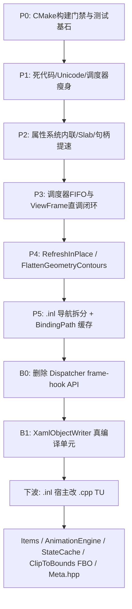

# AeroGUI-R 精简化重构总方案（修订版）

> **当前状态**：
> - **已全面落地并验证**：
>   - **C1 & P2 属性系统与元数据**：`Flush` FIFO 双指针、Winner $O(1)$ 缓存、Session Hash 化；`inlineLocal` 内联（免堆分配）、侵入式队列经 `QueueLink::next`、`PropertySlab` 分配器、`TypeBuilder` 内部实现收拢。
>   - **P0 & P1 基础设施与清理**：`CheckArchitecture.cmake` 门禁解耦通过；测试 CWD 解耦 (`AERO_TEST_SOURCE_DIR`)；死代码 `UnicodeAnalysis` 彻底物理删除；字素 Combining 字符集统一。
>   - **P3 调度器与线程模型**：P3.1 极简 FIFO 跨线程 MPSC 任务队列 + `ProcessPending()` 主循环 Pump；P3.2 `ViewFrame` 显式直调 6 大子引擎。已删除未使用的 `Dispatcher::RegisterFrameHook` / `RunFramePhase` 公共 API（树内零调用方）；`ProcessPending` / 跨线程 `Post` 保持不变。
>   - **P4 渲染首轮优化**：`RenderTree` 结构稳定时增量就地刷新 (`RefreshInPlace`)；`DrawingContext` 几何轮廓共享单次扁平化 (`FlattenGeometryContours`)；移除 D3D11 调试 BMP 转储。
>   - **P5 局部收尾**：`BindingPath::Compile` 全局哈希缓存落地；导航/宿主文件的 `.inl` 拆分（XamlLoader / XamlSchemaContext / Scroll / TextBox / Binding / StoryboardHost / TemplateProgram / Metadata）。
>   - **B1 XamlObjectWriter 真编译单元**：`XamlObjectWriter.cpp` 不再 amalgamate `.inl`。逻辑拆到独立 `.cpp`（core / Properties / Extensions / Scopes），标记扩展由专用 `.cpp` 包装各自 `.inl` 单独产出目标文件。
> - **待实施**：
>   - **XamlObjectWriter 之外的上帝 TU**：`Items.cpp`、`AnimationEngine.cpp`；把仍 amalgamated 的 `.inl` 宿主（XamlLoader、XamlSchemaContext、Metadata、Scroll、TextBox、Binding、StoryboardHost、TemplateProgram）改成真正的 `.cpp` 编译单元。
>   - **P4 渲染深度优化**：共享 GPU `StateCache`；`ClipToBounds` FBO；`FrameEncoder` 仍待消除每帧 $O(n^2)$ 节点查重与全量 Hash。
>   - **P5 收口**：`include/Aero/Meta.hpp` 瘦身；`samples/` 目录当前缺失（本波不恢复 ControlGallery/samples，除非测试需要）。

> **核心原则与红线**：
> 1. **WPF 语义零回归**；对外常用公共 API 零破坏性改名。死 API 删除仅限树内零调用方（本波：Dispatcher frame-hook 表）。
> 2. **保留跨线程任务封送能力**：已由 P3.1 与 `TestDispatcherCrossThreadPost` 确立保护。
> 3. **优先真编译单元边界，而不是继续往宿主 `#include *.inl`**。
> 4. **每步出口闭环**：全量构建 + `AeroFrameworkConformanceTests` + `CheckArchitecture.cmake` + 领域微基准 / 像素级门禁。

---

## 0. 代码现状与基线规模（实测更新）

### 0.1 最新规模指标
- 门禁状态：`CheckArchitecture.cmake` 架构检查；Conformance 测试由本波出口验证。
- 核心基础设施：`PropertySlab` 已入列；Dispatcher frame-hook 表已从安装头删除；`ViewFrame` 主驱动流水线已全面显式化。

### 0.2 上帝文件跟踪对比
| 文件路径 | 初始行数 | 当前行数 | 当前状态与说明 |
|---|---|---|---|
| `src/gui/markup/TemplateProgram.cpp` | 4126 | **16** | ✅ 已拆为 `.inl` 宿主；**待**改为独立 `.cpp` TU |
| `src/gui/meta/Metadata.cpp` | 4025 | **26** | ✅ 已拆为 `.inl` 宿主；**待**改为独立 `.cpp` TU |
| `src/gui/markup/XamlObjectWriter.cpp` | 7918 | **~1590** core + Properties / Extensions / Scopes + 7 个扩展 `.cpp` | ✅ 真编译单元（本波 B1） |
| `src/gui/markup/XamlLoader.cpp` | 5110 | **485** | 🟡 `.inl` 拆分已落地；**待**改为独立 `.cpp` TU |
| `src/gui/markup/XamlSchemaContext.cpp` | 4221 | **1074** | 🟡 `.inl` 拆分已落地；**待**改为独立 `.cpp` TU |
| `src/gui/controls/Scroll.cpp` | 3579 | **131** | 🟡 `.inl` 拆分已落地；**待**改为独立 `.cpp` TU |
| `src/gui/controls/Items.cpp` | 3408 | **2910** | 待解耦容器与生成逻辑 |
| `src/gui/controls/TextBox.cpp` | 3131 | **1025** | 🟡 `.inl` 拆分已落地；**待**改为独立 `.cpp` TU |
| `src/gui/data/Binding.cpp` | 2542 | **796** | 🟡 `.inl` 拆分已落地；**待**改为独立 `.cpp` TU |
| `src/gui/media/StoryboardHost.cpp` | 2463 | **528** | 🟡 部分已是独立 `.cpp`（Actions/Completions/Events）；Properties/Timelines 仍为 `.inl` |
| `src/render/RenderTree.cpp` | 2209 | **2535** | 🟡 已引入 `RefreshInPlace`，待剥离全量哈希与物理快照 |
| `src/gui/media/AnimationEngine.cpp` | 2102 | **2093** | 待拆分（时钟驱动与属性插值通道） |
| `src/render/FrameEncoder.cpp` | 1870 | **1881** | 🟡 `subtreeRange` 已消除 $O(n^3)$ 回溯；待共享 GPU `StateCache` / 查重瘦身 |
| `include/Aero/Meta.hpp` | — | **1854** | 待瘦身 |

---

## 1. 已全面落地的重构成果（C1 / P0–P5 / B0–B1）

### 1.1 属性系统高性能收敛（C1 + P2）
- **算法降度**：`EffectiveValueEngine::Flush` 采用 FIFO 双指针单次紧凑回收，消除 $O(n^2)$ 线性扫描；
- **Winner 缓存**：`PropertyProviderSet` 采用 swap-remove ($O(1)$) 与增量下标缓存，热路径 `Winner()` 降为 $O(1)$；
- **Local 内联免堆分配**：`StoredValueEntry` 直接内嵌 `inlineLocal`，简单 Local 读写 100% 零堆分配、无 OOM 回滚；
- **侵入式单链表队列**：`EffectiveValueEngine` 采用 `QueueLink::next` 与内部链接复用池，彻底消灭 vector 动态扩容与元素平移开销；
- **独立 Slab 分配器**：引入 `PropertySlab` 随 Dispatcher 实例生命周期绑定，彻底替换全局 `thread_local` 内存池；
- **别名快查**：`DependencyPropertyRegistry::CanonicalHandle` 单次 Hash 映射，去除运行时多层别名查找。

### 1.2 基础设施与测试脱敏（P0 & P1）
- **架构门禁**：`CheckArchitecture.cmake` 降为语义断言；
- **测试环境脱敏**：注入 `AERO_TEST_SOURCE_DIR`，使 Conformance 测试在任意工作目录下稳定运行；
- **死代码拔除**：彻底移除了全网零调用的 `UnicodeAnalysis.cpp/hpp`；
- **字符集修正**：统一补全阿拉伯语 Combining 字符范围 (`0x064B-065F`, `0x0670`)。

### 1.3 调度器与线程模型闭环（P3 + B0）
- **极简跨线程队列**：移除冗余的 10 级 priority 排序和 delayed 压缩算法，保留纯 FIFO 的线程安全 MPSC 任务队列；
- **主循环驱动闭环**：在 `ViewFrame.cpp` 帧入口显式接入 `ProcessPending()` 泵送；
- **直调架构落地（P3.2）**：`ViewFrame` 顺序直调 `values->Flush()`、`bindings->DataBindHook()`、`animations->AnimationFrameHook()`、`layout->LayoutHook()`、`renderer->RenderCommitHook()`；
- **死 API 删除（B0）**：安装头 `Threading.hpp` 移除 `RegisterFrameHook` / `RemoveFrameHook` / `RunFramePhase` / `RegisteredFrameHookCount` / `DispatcherFrameHookHandle`。`ProcessPending`、`Post` / `PostDelayed` / `Cancel` 不变。`FrameTimings()` 仍保留给 Inspector，当前恒为零。`CheckArchitecture.cmake` 禁止恢复 hook 表。
- **并发验证**：`TestDispatcherCrossThreadPost`（多工作线程并发 Post、延迟 Post、取消 Task）。

### 1.4 渲染与绑定初步提速（P4 & P5 既有成果）
- **结构稳定时就地增量 Commit**：`RenderTree` 检测到树形结构未发生增删时，走 `RefreshInPlace` 局部更新绘制记录，避免全树节点销毁重建；
- **几何轮廓单次扁平化**：`FlattenGeometryContours`，Fill 与 Stroke 共享单次 Flatten 结果；
- **D3D11 调试代码移除**：删除了调试 BMP dump 遗留文件与函数；
- **绑定路径编译缓存**：`BindingPath::Compile` 引入全局静态缓存，避免重复字符串语法分析；
- **FrameEncoder O(n) 子树遍历**：`FrameEncoder.cpp` 使用 `subtreeRange` 单次线性计算，消除回溯退化；
- **热路径哈希瘦身**：`RenderFrame::StableHash` 优化渐变 ramp 遍历，`ValidateRenderFrame` 校验精简。

### 1.5 上帝文件模块化解耦（P5 `.inl` 导航拆分 + B1 真 TU）
- **`.inl` 导航拆分（已落地，仍 amalgamated 进宿主 `.cpp`）**：
  - `StoryboardHost.cpp`、`Scroll.cpp`、`TextBox.cpp`、`XamlLoader.cpp`、`XamlSchemaContext.cpp`、`Binding.cpp`、`TemplateProgram.cpp`、`Metadata.cpp`。
- **B1 `XamlObjectWriter` 真编译单元（本波）**：
  - `XamlObjectWriter.cpp` — writer core / node stack
  - `XamlObjectWriter.Properties.cpp` — 属性写入 / 内容 / 事件连接
  - `XamlObjectWriter.Extensions.cpp` — 标记扩展求值
  - `XamlObjectWriter.Scopes.cpp` — 名字作用域 / 资源 / 延迟内容
  - `BindingExtension.cpp` 等 7 个包装 TU 分别编译既有扩展 `.inl`
  - 共享声明与辅助函数：`XamlObjectWriterInternal.hpp`

---

## 2. 剩余工作（下一波）

1. **把 amalgamated `.inl` 宿主改成真实 `.cpp` TU**（XamlLoader、XamlSchemaContext、Metadata、Scroll、TextBox、Binding、StoryboardHost Properties/Timelines、TemplateProgram）。不要再往宿主里 `#include` 更多 `.inl`。
2. **`Items.cpp`（~2910）**：容器与 item generation 解耦。
3. **`AnimationEngine.cpp`（~2093）**：时钟驱动与属性插值通道拆分。
4. **共享 GPU `StateCache`**：后端之间去掉重复管线/状态对象。
5. **`ClipToBounds` FBO**：离屏裁剪路径（当前仍是 CPU/layout clip 语义）。
6. **`include/Aero/Meta.hpp` 瘦身**（~1854 行 umbrella）。
7. **`samples/`**：目录当前不在树内；不在本波恢复 ControlGallery/samples。

---

## 3. 重构验收矩阵与质量状态

### 验收出口标准
- **编译与门禁**：Release 构建，`CheckArchitecture.cmake` Passed；
- **功能测试**：`AeroFrameworkConformanceTests` 通过；
- **模块边界**：`XamlObjectWriter` 产出多个 `.o`，而不是单一 mega object；WPF 语义不回归。
