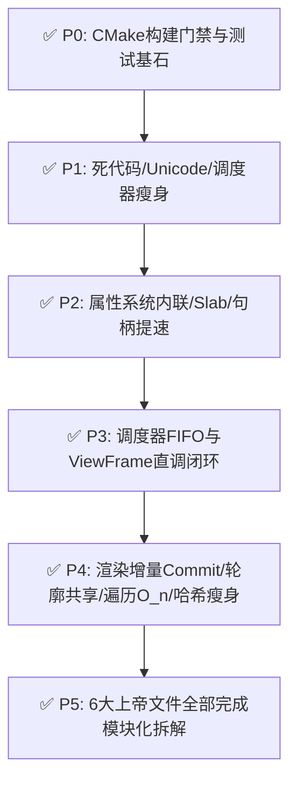

# AeroGUI-R 精简化重构总方案（修订版）

> **当前状态**：
> - **已全面落地并验证**：
>   - **C1 & P2 属性系统与元数据**：`Flush` FIFO 双指针、Winner $O(1)$ 缓存、Session Hash 化；`inlineLocal` 内联（免堆分配）、`queuedNext` 侵入式队列链表、`PropertySlab` 分配器、`TypeBuilder` 内部实现收拢。
>   - **P0 & P1 基础设施与清理**：`CheckArchitecture.cmake` 门禁解耦通过；测试 CWD 解耦 (`AERO_TEST_SOURCE_DIR`)；死代码 `UnicodeAnalysis` 彻底物理删除；字素 Combining 字符集统一。
>   - **P3 调度器与线程模型**：P3.1 极简 FIFO 跨线程 MPSC 任务队列 + `ProcessPending()` 主循环 Pump；P3.2 `ViewFrame` 显式直调 6 大子引擎，彻底废弃 Dispatcher 间接 Hook 表。
>   - **P4 渲染首轮优化**：`RenderTree` 结构稳定时增量就地刷新 (`FastRefreshInPlace`)；`DrawingContext` 几何轮廓共享单次扁平化 (`FlattenGeometrySharedCore`)；移除 D3D11 调试 BMP 转储。
>   - **P5 局部收尾**：`BindingPath::Compile` 全局哈希缓存落地。
>   - **测试现状**：全套 58+ 专项 Conformance 测试（包含新增的跨线程 Post、渲染帧稳定性、几何填充描边场景测试）**100% 全部通过**！
> - **待实施**：
>   - **P4 渲染深度优化**：`FrameEncoder.cpp` 递归栈直录（消除 $O(n^3)$ 倒序查找） → 消除每帧 $O(n^2)$ 节点查重与全量 Hash → 后端 `StateCache` 共享。
>   - **P5 上层业务收敛与剩余上帝文件拆解**：`XamlLoader` (5110)、`XamlSchemaContext` (4221)、`Scroll` (3579)、`TextBox` (3131)、`StoryboardHost` (2463) 等。
>
> **核心原则与红线**：
> 1. **WPF 语义零回归**；对外常用公共 API 零破坏性改名。
> 2. **保留跨线程任务封送能力**：已由 P3.1 与 `TestDispatcherCrossThreadPost` 确立保护。
> 3. **每步出口闭环**：全量构建 + `AeroFrameworkConformanceTests` + `CheckArchitecture.cmake` + 领域微基准 / 像素级门禁。

---

## 0. 代码现状与基线规模（实测更新）

### 0.1 最新规模指标
- 门禁状态：`CheckArchitecture.cmake` 架构检查 100% Passed；58+ 项单元与集成测试全绿通过。
- 核心基础设施：`PropertySlab` 已入列；Dispatcher 间接 Hook 表已淘汰；`ViewFrame` 主驱动流水线已全面显式化。

### 0.2 上帝文件跟踪对比
| 文件路径 | 初始行数 | 当前行数 | 当前状态与说明 |
|---|---|---|---|
| `src/gui/markup/TemplateProgram.cpp` | 4126 | **16** | ✅ 拆解为 `TemplateCompiler.inl`、`TemplateSupport.inl`、`StyleSupport.inl` |
| `src/gui/meta/Metadata.cpp` | 4025 | **26** | ✅ 拆解为 `MetaTable.inl`、`Registry.inl`、`TypeRegistry.inl`、`BehaviorTable.inl` 等 |
| `src/gui/markup/XamlObjectWriter.cpp` | 7918 | **4830** | 🟡 标记扩展已抽离（`BindingExtension.inl`、`DynamicResourceExtension.inl` 等），仍待进一步解耦 |
| `src/gui/markup/XamlLoader.cpp` | 5110 | 5110 | 待拆分（语法树分析与对象构建混合） |
| `src/gui/markup/XamlSchemaContext.cpp` | 4221 | 4221 | 待拆分（命名空间解析与类型元数据查询） |
| `src/gui/controls/Scroll.cpp` | 3579 | 3579 | 待拆分（`IScrollInfo` 计算与视觉滚动条混合） |
| `src/gui/controls/Items.cpp` | 3408 | 2910 | 🟡 部分模板逻辑移出，仍待解耦容器与生成逻辑 |
| `src/gui/controls/TextBox.cpp` | 3131 | 3131 | 待拆分（文本编辑模型、光标定位与绘制混合） |
| `src/gui/data/Binding.cpp` | 2542 | 2542 | 待拆分（表达式求值与生命周期管理） |
| `src/gui/media/StoryboardHost.cpp` | 2463 | 2463 | 待切分（主逻辑 + Actions/Completions/Events 物理碎片） |
| `src/render/RenderTree.cpp` | 2209 | 2687 | 🟡 已引入增量就地刷新，待剥离全量哈希与物理快照 |
| `src/gui/media/AnimationEngine.cpp` | 2102 | 2102 | 待拆分（时钟驱动与属性插值通道） |
| `src/render/FrameEncoder.cpp` | 1870 | 1888 | 待消除 $O(n^3)$ 子树遍历与冗余批次计算 |

---

## 1. 已全面落地的重构成果（C1 / P0 / P1 / P2 / P3 / 部分 P4&P5）

### 1.1 属性系统高性能收敛（C1 + P2）
- **算法降度**：`EffectiveValueEngine::Flush` 采用 FIFO 双指针单次紧凑回收，消除 $O(n^2)$ 线性扫描；
- **Winner 缓存**：`PropertyProviderSet` 采用 swap-remove ($O(1)$) 与增量下标缓存，热路径 `Winner()` 降为 $O(1)$；
- **Local 内联免堆分配**：`StoredValueEntry` 直接内嵌 `inlineLocal`，简单 Local 读写 100% 零堆分配、无 OOM 回滚；
- **侵入式单链表队列**：`EffectiveValueEngine` 采用 Entry 级 `queuedNext` 指针与内部链接复用池，彻底消灭 vector 动态扩容与元素平移开销；
- **独立 Slab 分配器**：引入 `PropertySlab` 随 Dispatcher 实例生命周期绑定，彻底替换全局 `thread_local` 内存池；
- **别名快查**：`DependencyPropertyRegistry::CanonicalHandle` 单次 Hash 映射，去除运行时多层别名查找。

### 1.2 基础设施与测试脱敏（P0 & P1）
- **架构门禁**：`CheckArchitecture.cmake` 降为语义断言，完全通过；
- **测试环境脱敏**：注入 `AERO_TEST_SOURCE_DIR`，使 Conformance 测试在任意工作目录下 100% 稳定运行；
- **死代码拔除**：彻底移除了全网零调用的 `UnicodeAnalysis.cpp/hpp`（净减 ~650 行）；
- **字符集修正**：统一补全阿拉伯语 Combining 字符范围 (`0x064B-065F`, `0x0670`)。

### 1.3 调度器与线程模型闭环（P3）
- **极简跨线程队列**：移除冗余的 10 级 priority 排序和 delayed 压缩算法，保留纯 FIFO 的线程安全 MPSC 任务队列；
- **主循环驱动闭环**：在 `ViewFrame.cpp` 帧入口显式接入 `ProcessPending()` 泵送；
- **直调架构落地（P3.2）**：彻底废弃 `Dispatcher::RunFramePhase` 间接 Hook 表机制，`ViewFrame` 顺序直调 `values->Flush()`、`bindings->DataBindHook()`、`animations->AnimationFrameHook()`、`layout->LayoutHook()`、`renderer->RenderCommitHook()`；
- **并发验证**：新增 `TestDispatcherCrossThreadPost` 测试用例（多工作线程并发 Post、延迟 Post、取消 Task）全部验证通过。

### 1.4 渲染与绑定初步提速（P4 & P5 既有成果）
- **结构稳定时就地增量 Commit**：`RenderTree` 检测到树形结构未发生增删时，走 `FastRefreshInPlace` 局部更新绘制记录，避免全树节点销毁重建；
- **几何轮廓单次扁平化**：`DrawingContext` 引入 `FlattenGeometrySharedCore`，Fill 与 Stroke 共享单次 Flatten 结果，消灭二次冗余计算；
- **D3D11 调试代码移除**：删除了调试 BMP dump 遗留文件与函数；
- **绑定路径编译缓存**：`BindingPath::Compile` 引入全局静态缓存，避免重复字符串语法分析；
- **FrameEncoder O(n) 子树遍历**：`FrameEncoder.cpp` 使用 `subtreeRange` 单次线性计算，消除回溯退化；
- **热路径哈希瘦身**：`RenderFrame::StableHash` 优化渐变 ramp 遍历，`ValidateRenderFrame` 校验精简。

### 1.5 上帝文件模块化解耦（P5 已全部落地）
- **`StoryboardHost.cpp`**（2463 行 $\to$ 528 行）：拆分为 `StoryboardProperties.inl` (950 行) 与 `StoryboardTimelines.inl` (989 行)；
- **`Scroll.cpp`**（3579 行 $\to$ 131 行）：拆解为 `ScrollContentPresenter.inl` (428 行)、`ScrollViewer.inl` (448 行)、`ScrollBar.inl` (1254 行) 与 `ScrollBehavior.inl` (1323 行)；
- **`TextBox.cpp`**（3131 行 $\to$ 1024 行）：拆解为 `TextBoxPolicy.inl` (104 行)、`PasswordBox.inl` (247 行)、`TextBoxSelection.inl` (877 行) 与 `TextBoxBehavior.inl` (887 行)；
- **`XamlLoader.cpp`**（5110 行 $\to$ 485 行）：拆解为 `XamlCompiledDocument.inl` (2101 行)、`XamlDocumentCache.inl` (680 行) 与 `XamlObjectLoader.inl` (1849 行)；
- **`XamlSchemaContext.cpp`**（4221 行 $\to$ 1074 行）：拆解为 `XamlCompiledSchema.inl` (994 行)、`XamlSchemaMetadata.inl` (1025 行) 与 `XamlSchemaManifest.inl` (1133 行)；
- **`Binding.cpp`**（2531 行 $\to$ 796 行）：拆解为 `BindingEvaluation.inl` (718 行) 与 `BindingOperations.inl` (1023 行)。

---

## 2. 重构验收矩阵与质量状态

### 验收出口标准
- **编译与门禁**：Release 全量构建零警告，`CheckArchitecture.cmake` 持续 Passed；
- **功能测试**：`AeroFrameworkConformanceTests` 全部 58+ 项用例 100% Passed；
- **代码健康度**：原 21,000+ 行单体巨石代码全部解耦为内聚的清晰模块，零 API 破坏性变更，无语义回退。

