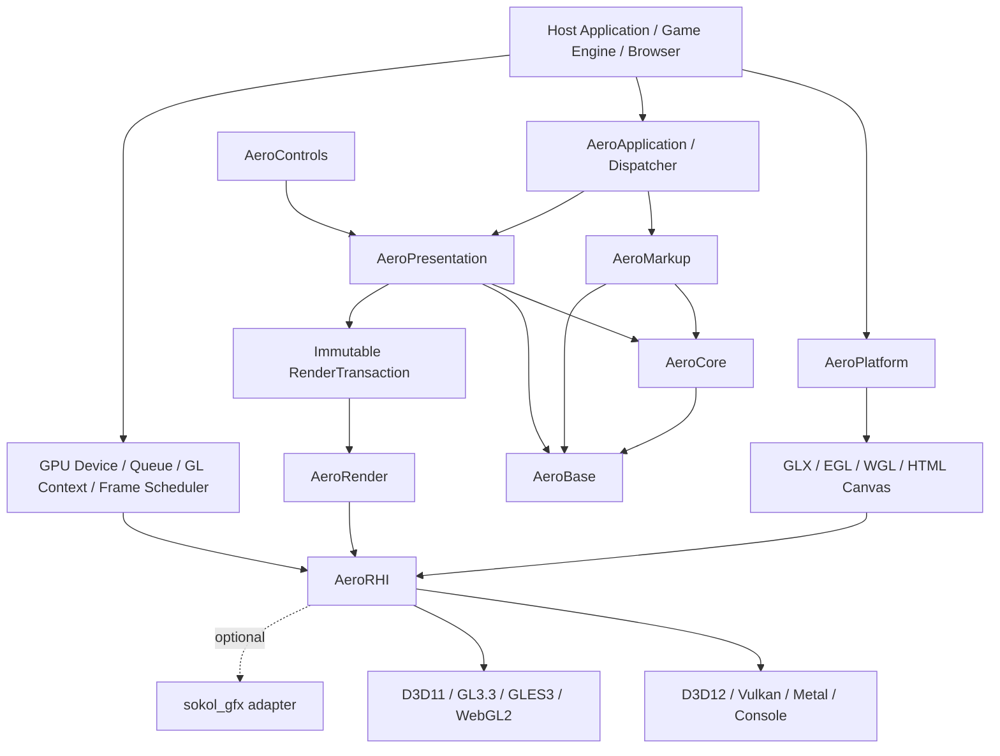

# AeroGUI WPF C++ Port 重构规格

- **状态**：Architecture Baseline
- **版本**：0.3
- **目标语言**：ISO C++17
- **兼容基准**：WPF 公开行为
- **架构参考**：Moonlight 与 NoesisGUI 的公开资料
- **产品定位**：可嵌入、保留模式、原生 GPU 的 XAML UI engine
- **平台范围**：桌面、移动、游戏主机、浏览器/WebAssembly
- **实现模式**：clean-room reimplementation
- **规范用语**：MUST / SHOULD / MAY 分别表示必须、建议和可选

> 仓库当前没有可重构的既有 C++ UI 实现。本规范中的“重构”是建立一套替代逐类翻译 WPF 的模块边界、行为合同、基础设施、原生 GPU 渲染架构、兼容后端、测试方法和迁移目标，再按垂直切片实现。

## 1. 核心结论

AeroGUI 已接受以下方向：

1. 所有 Runtime、工具、测试和示例只使用 C++17，不采用 C++20；
2. `AeroBase` 自实现 allocator、String、Vector、HashMap、HashSet、Result、Ref/WeakRef 等关键基础类型；
3. 标准库可用于合适的私有实现和工具，但 STL owning type 不进入稳定公共 ABI；
4. AeroGUI 是类似 NoesisGUI 产品定位的原生 GPU UI engine，但采用独立 clean-room 实现；
5. 生产渲染不支持 Skia；
6. 自有 `AeroRHI` 支持 strategic backends：D3D12、Vulkan、Metal 和 private console backends；
7. 正式 compatibility backends：D3D11、OpenGL 3.3 Core、OpenGL ES 3.0、WebGL 2；
8. GLX、EGL 和 WGL 是 Platform 层的 context/surface adapter，不是 RHI 绘制后端；
9. WebGL 1 不进入 v1，也不作为 fallback；
10. sokol 只作为可选 adapter、sample 或 bring-up backend，不是核心 RHI；
11. FreeType、HarfBuzz、Expat、libtess2、Ryu 通过可替换 provider 可选集成；
12. 宿主拥有窗口、线程、event loop、GPU device/context、queue、command submission 和 presentation；
13. Runtime 公共合同不依赖 exceptions、C++ RTTI 或 C++20 library。

## 2. 为什么不能逐类翻译 WPF

逐类把 `System.Windows.*` 改写成 C++ 容易造成：

- property、Binding、Style、Animation 和 layout 相互硬编码；
- logical、visual 和 render 数据混成一棵对象树；
- render thread 回调 UI/user object，引入锁、重入和悬空引用；
- XAML loader 依赖具体 control，无法独立测试或 AOT；
- Win32、字体库和 GPU API 渗透到 Core；
- 公共 API 暴露 STL/编译器 ABI，难以接入游戏引擎和主机 SDK；
- GL context、GLX surface、D3D device 与 UI object 生命周期混合；
- desktop GL、GLES 和 WebGL 被误认为完全相同；
- 看起来像 WPF，却没有 property precedence、resource lookup 和 event order 的行为测试。

AeroGUI 必须打通一条最小而完整的主链路：

```text
UTF-8 XAML
 -> XML token stream
 -> XAML node stream
 -> Type/Property metadata
 -> Dependency Objects
 -> Logical/Visual Trees
 -> Binding/Resource/Style
 -> Measure/Arrange
 -> Immutable RenderTransaction
 -> Retained Render Tree
 -> Backend-independent RenderPlan
 -> AeroRHI
 -> Native GPU / WebGL commands
```

高级功能不得绕过这条链路。

## 3. 目标

AeroGUI MUST：

1. 提供无 CLR 依赖、可嵌入的 C++17 UI runtime；
2. 对已声明支持的 WPF/XAML 子集提供可测试语义兼容；
3. 实现统一的 Dependency Property、Binding、Resource、Style 和 Template 基础；
4. 分离 object graph、logical tree、visual tree 和 render tree；
5. 使用 retained render tree 与 immutable/incremental scene transaction；
6. 使用自有原生 GPU render pipeline，不依赖 Skia；
7. 支持 D3D12、Vulkan、Metal、D3D11、OpenGL、OpenGL ES、WebGL 2 和 console-private backend；
8. 正确分离 RHI backend 与 GLX/EGL/WGL/HTML Canvas platform surface；
9. 支持单线程和 UI/render 双线程宿主模型；Web profile 支持浏览器事件循环驱动；
10. 允许宿主提供 allocator、threading、file、text、image、window、GPU 和 accessibility provider；
11. 支持 exceptions-off、RTTI-off 构建；
12. 对未知、受限或部分支持行为给出稳定诊断；
13. 用 conformance、golden、fuzz、sanitizer、browser tests 和 performance gates 约束实现。

## 4. 非目标

v1 不承诺：

- WPF/.NET 二进制、ABI 或 C# 源码兼容；
- BAML 兼容；
- FlowDocument、XPS、Printing、MediaElement、WPF 3D 或浏览器插件；
- 首次发布即覆盖全部控件和全部边缘行为；
- C++20、Modules、Ranges、Coroutines 或 C++20 标准库；
- Skia renderer、Skia fallback 或以 Skia 作为 golden oracle；
- OpenGL fixed-function/compatibility profile；
- WebGL 1；
- 把 GLX 当作跨平台渲染 API；
- 复制 WPF、Moonlight 或 NoesisGUI 内部实现；
- 将 sokol、FreeType、HarfBuzz、Expat、libtess2 或 Ryu 变成不可替换公共依赖。

## 5. 兼容性合同

| 层级 | 合同 | 验证 |
| --- | --- | --- |
| Syntax | XAML 文法、namespace、type/member resolution | parser/object-writer golden tests |
| Semantic | 属性优先级、资源、Binding、布局、事件路由 | WPF differential probes |
| Visual | 几何、文本位置、颜色、clip、template | layout snapshots + backend pixel diff |
| API | AeroGUI C++17 source compatibility | compile tests + semantic versioning |
| ABI | versioned C function table/opaque handles | struct-size/version compatibility tests |
| Platform | host/window/context/input/text contracts | adapter conformance suites |
| RHI | RenderPlan/resource/pass/capability contract | Null + native/compatibility backend suites |
| Web | browser loop、context loss、WASM/JS boundary | WebGL 2 browser automation |

每个 release MUST 发布 capability manifest，列出：

- 支持的 XAML namespace、markup extension 和 controls；
- features 的 `core` / `partial` / `unsupported` 状态；
- text、font、XML、geometry 和 RHI provider；
- GPU backend、tier、API/shader version 与 capability bits；
- GLX/EGL/WGL/HTML Canvas 等 surface adapter；
- WebGL extensions 和 context-loss recovery；
- exceptions/RTTI/build flags；
- 已知兼容差异；
- manifest schema version。

Runtime loader 与 `aero-xamlc` MUST 使用同一 manifest。未知类型、未知成员、资源循环、Binding path 错误、缺失 provider、缺失 GPU capability 和线程/context 违规不得静默忽略。

## 6. 总体架构



### 6.1 模块职责

| 模块 | 职责 |
| --- | --- |
| `AeroBase` | allocator、memory、String、containers、Result、Ref/WeakRef、diagnostics 基础 |
| `AeroCore` | Object、Dispatcher、TypeRegistry、DependencyProperty、Expression、事件基础 |
| `AeroMarkup` | XML/XAML node stream、schema、object writer、markup extension、compiled XAML IR |
| `AeroPresentation` | Visual/UIElement/FrameworkElement、树、layout、Binding、Resource、Style、Template、Input |
| `AeroControls` | Control、ContentControl、ItemsControl、Panel 和标准控件 |
| `AeroRender` | render tree、scene transactions、geometry/text/image cache、RenderPlan |
| `AeroRHI` | GPU resource、pipeline、pass、command、state 与 synchronization contracts |
| `AeroPlatform` | window/canvas、GLX/EGL/WGL、input、IME、clipboard、file、time、DPI 和 accessibility bridge |
| `AeroTestKit` | WPF probes、golden XAML、layout/render snapshots、browser harness、fuzz |

约束：

- Base 不依赖第三方 runtime 库；
- Core 不依赖 Presentation、Controls、Platform 或 renderer；
- Presentation 不包含 Win32/X11/Cocoa/D3D/Vulkan/Metal/GL/WebGL/sokol 类型；
- Render 不依赖 control class；
- RHI 不依赖 XAML、Binding、Visual 或 window-system API；
- GLX/EGL/WGL/HTML Canvas adapter 不定义 drawing primitive；
- module graph MUST 保持有向无环；
- backend/provider 通过显式 factory/function table 注入。

## 7. C++17 与 Foundation

C++17 是唯一语言基线。Visual Studio 2026 等更新工具链以 `/std:c++17` 构建，不能因为 IDE/toolset 更新而使用更高标准。

`AeroBase` MUST 提供：

```text
IAllocator / MemoryTag / OOM policy
String / StringView / UTF conversion adapters
Span / Vector / SmallVector
HashMap / HashSet
Optional / Result / Value
Object / Ref / WeakRef / Unique
Delegate / Subscription / Handle
```

规则：

- UTF-8 是 Runtime 字符串规范编码；
- containers 使用显式 allocator；
- `Collection<T>` 是 Presentation 层 observable model，不是 Vector 别名；
- public binary boundary 不暴露 STL owning types；
- Runtime API 不 throw，也不依赖 RTTI；
- dynamic SDK/plugin boundary 使用 versioned C function table、POD 和 opaque handles；
- 不使用 `AutoPtr` 名称，intrusive 指针命名为 `Ref<T>` / `WeakRef<T>`。

完整合同见 [`spec/FOUNDATION_ABI.md`](spec/FOUNDATION_ABI.md)。

## 8. 四种结构

| 结构 | 用途 |
| --- | --- |
| Object graph | C++ 所有权和一般引用关系 |
| Logical tree | 内容模型、DataContext/属性继承、资源查找 |
| Visual tree | layout、hit test、event route、template visuals |
| Render tree | render domain 紧凑场景，不含用户对象指针 |

一个 Visual MAY 产生零个、一个或多个 render nodes。Logical parent、visual parent 和 render parent 不要求相同。

## 9. 线程、context 与帧不变量

- 可变 UI 对象只允许在所属 Dispatcher 访问；
- Core 不创建永久线程；
- UI/render 之间只传不可变 transaction、稳定 ID 和显式资源消息；
- render thread 不执行 Binding、layout、XAML 或 user callback；
- 同一合同支持 single-thread immediate apply 和 dual-thread queue；
- platform callback marshal 到 UI Dispatcher；
- Freezable 只有冻结后才可跨线程只读共享；
- GPU submission、fence 和 presentation 由 host policy 控制；
- reference-count thread safety 不等于对象状态 thread-safe；
- GL/GLES context 只允许在 current thread 使用，不隐式迁移；
- Web frame 由浏览器 host callback 驱动，不阻塞 event loop。

标准阶段：

```text
PumpPlatformOrBrowserEvents
 -> DispatchInput
 -> FlushPropertyChanges
 -> UpdateBindings
 -> UpdateAnimations
 -> Measure/Arrange
 -> RaiseLifecycleEvents
 -> BuildRenderTransaction
 -> ApplyRenderTransaction
 -> BuildRenderPlan
 -> RecordGpuOrWebGLCommands
```

## 10. 原生 GPU 与兼容 backend 架构

AeroGUI 的“GPU UI”定义为：

> 所有产品级 raster/composition 由 native GPU API 或 WebGL 2 执行；XAML、property、Binding、layout、text shaping、scene diff 和必要的 CPU tessellation 仍在 CPU/WASM 侧完成。

### 10.1 Strategic backends

```text
AeroRHI_D3D12
AeroRHI_Vulkan
AeroRHI_Metal
AeroRHI_ConsolePrivate
```

### 10.2 Compatibility backends

```text
AeroRHI_D3D11
AeroRHI_OpenGL33
AeroRHI_GLES30
AeroRHI_WebGL2
```

### 10.3 Validation

```text
AeroRHI_Null
```

Skia 不进入依赖图、测试图或 fallback 图。

兼容后端 MUST 使用同一 RenderPlan contract，并通过 capability fallback 实现基础 UI path。Compute、bindless、storage buffer、indirect draw 和 persistent mapping 不作为兼容基线。

## 11. D3D11 决策

`AeroRHI_D3D11` 是第一方正式兼容 backend：

- feature level 10_0 minimum；11_0/11_1 preferred；
- v1 不支持 9_x baseline；
- VS/PS 是基础路径，compute 为 optional capability；
- HLSL 离线编译为 DXBC；
- 支持 owned device 和 host-provided device/context；
- embedded mode 定义 state ownership 和 hazard cleanup；
- optional feature 通过 query，而不是 GPU 名称推断。

## 12. OpenGL、GLES 与 surface adapter

### 12.1 Desktop OpenGL

- OpenGL 3.3 Core + GLSL 3.30；
- 不使用 compatibility/fixed-function API；
- 支持 state cache、owned/borrowed context；
- embedded mode 明确 `AeroRestoresDocumentedState` 或 `HostResetsStateAfterAero`；
- extension 只作为 optional optimization。

### 12.2 OpenGL ES

- OpenGL ES 3.0 + GLSL ES 3.00；
- 主要用于 Android/EGL、嵌入式和 Linux/EGL；
- 与 WebGL 2 共享 canonical shader feature subset；
- GLES 3.1/3.2 只作为能力增强。

### 12.3 GLX/EGL/WGL

```text
AeroPlatform_GLX  -> Linux/X11 + OpenGL33
AeroPlatform_EGL  -> Android/Wayland/headless + GLES30/OpenGL
AeroPlatform_WGL  -> Windows + OpenGL33
```

GLX baseline 为 1.4；现代 core context 通过运行时查询的 `GLX_ARB_create_context` 创建。Wayland 不使用 GLX。游戏引擎提供现有 context 时可跳过 platform context adapter。

详细合同见 [`spec/COMPATIBILITY_BACKENDS.md`](spec/COMPATIBILITY_BACKENDS.md)。

## 13. WebGL 2 决策

`AeroRHI_WebGL2` 是正式兼容 backend：

- 面向 C++17 → WebAssembly；
- WebGL 2 + GLSL ES 3.00；
- WebGL 1 不支持；
- HTMLCanvasElement 或 OffscreenCanvas；
- baseline 不依赖 compute、SSBO、bindless、persistent mapping 或 blocking wait；
- 浏览器 host 使用 `requestAnimationFrame` 或等价 callback；
- 第一阶段主渲染线程为 baseline，Worker/OffscreenCanvas 为 optional capability；
- context loss 后所有 WebGL object/extension 失效，restore 时重新 query caps 并重建资源；
- 必须处理 `webglcontextlost` / `webglcontextrestored`；
- 测试使用 `WEBGL_lose_context`；
- GLSL source 离线生成、验证、反射和固定版本，但由浏览器运行时 compile/link；
- resource retirement 使用后续 frame polling 或延迟删除，不 busy-wait。

## 14. sokol 决策

`sokol_gfx` MAY 通过 `AeroRHI_Sokol` 使用，适合其公开支持的 D3D11、GL3.3、GLES3/WebGL2、Metal 和 WebGPU 环境。但仅限：

- bring-up、sample、tool、WASM experiment；
- 对 RenderPlan/RHI contract 的额外适配验证；
- 与第一方 backend 的差异测试。

`sokol_gfx` MUST NOT：

- 定义 AeroRHI API；
- 成为所有 backend 的 mandatory lower layer；
- 替代 D3D12/Vulkan/console native backend；
- 替代第一方 D3D11/GL/GLES/WebGL2 长期合同；
- 被视为公开 console support；
- 让 `sokol_app` 接管嵌入式 runtime 主循环；
- 把 `sg_*` type 泄漏到公共接口。

## 15. Shader policy

| Backend | Release shader form |
| --- | --- |
| D3D11 | HLSL → offline DXBC |
| D3D12 | HLSL → offline DXIL |
| Vulkan | offline SPIR-V |
| Metal | packaged MSL/metallib per platform policy |
| OpenGL 3.3 | offline generated/validated GLSL 330 source，driver runtime compile/link |
| GLES 3.0 | offline generated/validated GLSL ES 300 source，driver runtime compile/link |
| WebGL 2 | embedded generated/validated GLSL ES 300 source，browser runtime compile/link |
| Console | offline private platform package |

WebGL 2、OpenGL 和 GLES 是“发行版不得运行时 shader JIT”规则的明确 API 例外；项目仍必须离线完成生成、校验、reflection、binding layout、versioning 和 packaging。

## 16. 第三方 provider

| 库 | Interface boundary | 状态 |
| --- | --- | --- |
| FreeType | `IFontProvider` / `IGlyphRasterizer` | 推荐默认，可替换 |
| HarfBuzz | `ITextShaper` | 完整复杂文本推荐默认，可替换 |
| Expat | `IXmlTokenizer` | Runtime XAML 推荐默认，可替换/关闭 |
| libtess2 | `IGeometryTessellator` | experimental，可替换 |
| Ryu | `IFloatFormatter` | 推荐默认，可替换 |
| sokol | `AeroRHI` adapter | optional，默认关闭 |

规则：

- third-party type 不进入 public API；
- dependency 可以 system、vendored 或 host-provider 模式提供；
- 版本、commit、checksum、license、NOTICE 和 patch 必须锁定；
- dependency-off build 必须存在；
- capability manifest 记录实际 provider；
- untrusted XML/font/geometry 输入必须 fuzz 和配额限制；
- libtess2 因维护状态必须有替代计划；
- HarfBuzz 不负责完整 bidi/line break，保留独立 Unicode/paragraph service；
- 详见 [`THIRD_PARTY.md`](THIRD_PARTY.md)。

## 17. 实施原则

1. **公开行为优先于内部相似**：WPF 行为是基准，参考产品只帮助分层。
2. **基础设施先行**：allocator、String、containers、Ref/WeakRef 先于 UI objects。
3. **失效驱动**：property metadata 精确标记 Measure/Arrange/Render/Inheritance 影响。
4. **事务化变更**：property、tree、template 和 render commit 不暴露半更新状态。
5. **先垂直切片**：禁止先批量创建空 control class。
6. **RenderPlan contract-first**：正式和兼容 backend 共享同一上层合同。
7. **Platform/RHI 分层**：GLX/EGL/WGL/Canvas 不进入 drawing model。
8. **诊断优先**：不支持状态必须可定位。
9. **测试可重复**：时间、字体、DPI、资源、shader、browser 和 backend fixture 可锁定。
10. **先 source compatibility**：v1 不承诺 C++ ABI，稳定 binary boundary 使用 C API。
11. **依赖可关闭**：第三方库不能成为隐含不可移除的设计支柱。

## 18. 规范分章

以下文件与本文件具有相同规范效力：

- [`spec/FOUNDATION_ABI.md`](spec/FOUNDATION_ABI.md)：C++17、allocator、String、containers、Ref/WeakRef 与 ABI；
- [`spec/CORE_RUNTIME.md`](spec/CORE_RUNTIME.md)：Object、Dispatcher、metadata、Dependency Property 和 tree transaction；
- [`spec/XAML_PRESENTATION.md`](spec/XAML_PRESENTATION.md)：XAML、Resource、Binding、Layout、Event、Style、Template 和 Controls；
- [`spec/RENDERING_PLATFORM.md`](spec/RENDERING_PLATFORM.md)：RenderTransaction、AeroRHI、native GPU、platform、text 和 image；
- [`spec/COMPATIBILITY_BACKENDS.md`](spec/COMPATIBILITY_BACKENDS.md)：D3D11、OpenGL、GLES、GLX/EGL/WGL 和 WebGL 2；
- [`spec/QUALITY_ROADMAP.md`](spec/QUALITY_ROADMAP.md)：diagnostics、build、test、performance、security、milestone；
- [`THIRD_PARTY.md`](THIRD_PARTY.md)：optional dependency policy。

冲突优先级：最新 Accepted ADR > 本主规范 > 分章规范 > README 示例。

## 19. 已决策事项

| ID | 决策 | 状态 |
| --- | --- | --- |
| D-001 | 全项目 ISO C++17，不采用 C++20 | Accepted |
| D-002 | WPF 公开语义是主要兼容基准 | Accepted |
| D-003 | 自有 AeroBase allocator/String/containers/Result | Accepted |
| D-004 | intrusive `Ref<T>` / `WeakRef<T>` | Accepted |
| D-005 | logical、visual、render tree 分离 | Accepted |
| D-006 | retained render tree + immutable transactions | Accepted |
| D-007 | 原生 GPU AeroRHI；不支持 Skia | Accepted |
| D-008 | Strategic backend 为 D3D12/Vulkan/Metal/console-private | Accepted |
| D-009 | Compatibility backend 为 D3D11/GL3.3/GLES3/WebGL2 | Accepted |
| D-010 | GLX/EGL/WGL/Canvas 属于 Platform/surface 层 | Accepted |
| D-011 | WebGL 2 正式支持；WebGL 1 不支持 | Accepted |
| D-012 | sokol 仅 optional adapter，默认关闭 | Accepted |
| D-013 | third-party 通过可替换 provider，可全部关闭 | Accepted |
| D-014 | public binary boundary 使用 versioned C function table | Accepted |
| D-015 | Runtime API 不依赖 exceptions 或 C++ RTTI | Accepted |
| D-016 | runtime 与 compiled XAML 共享 node/object-writer 语义 | Accepted |
| D-017 | v1 只保证 C++ source compatibility | Accepted |
| D-018 | BAML、FlowDocument、WPF 3D 不进入 v1 | Accepted |

对应 ADR 位于 [`adr`](adr)。

## 20. Clean-room 与许可证

### WPF

允许阅读公开文档、调用公开 API、编写行为测试和记录可观察结果。禁止依赖 WPF 私有实现细节。

### Moonlight

仅作为跨平台 native runtime、宿主边界和 render backend 的历史参考。默认不复制源码；任何源码级复用必须单独评估许可证、隔离方式和 NOTICE。

### NoesisGUI

只允许参考公开文档中的架构概念。禁止提交 SDK 私有源码、反编译结果、受 NDA/许可限制材料、私有 shader 或序列化格式。AeroBase、对象模型、RHI 和渲染算法必须独立设计。

### Third-party

第三方依赖的工程记录不构成法律意见。发行前必须确认实际源码版本、启用组件、许可证选择、归属声明和平台分发限制。

## 21. 参考资料

### WPF

- <https://learn.microsoft.com/dotnet/desktop/wpf/advanced/wpf-architecture>
- <https://learn.microsoft.com/dotnet/desktop/wpf/properties/dependency-properties-overview>
- <https://learn.microsoft.com/dotnet/desktop/wpf/properties/dependency-property-value-precedence>
- <https://learn.microsoft.com/dotnet/desktop/wpf/advanced/layout>
- <https://learn.microsoft.com/dotnet/desktop/wpf/advanced/trees-in-wpf>
- <https://learn.microsoft.com/dotnet/desktop/wpf/events/routed-events-overview>
- <https://learn.microsoft.com/dotnet/desktop/wpf/data/>
- <https://learn.microsoft.com/dotnet/desktop/wpf/advanced/threading-model>

### Moonlight / NoesisGUI

- <https://www.mono-project.com/docs/web/moonlight/>
- <https://www.noesisengine.com/docs/Gui.Core.Architecture.html>
- <https://www.noesisengine.com/docs/Gui.Core.CppArchitectureGuide.html>
- <https://www.noesisengine.com/docs/Gui.DependencySystem.Index.html>
- <https://www.noesisengine.com/docs/Gui.Core.RenderingTutorial.html>

### Graphics

- <https://learn.microsoft.com/windows/win32/direct3d11/dx-graphics-overviews>
- <https://registry.khronos.org/OpenGL/>
- <https://registry.khronos.org/webgl/specs/latest/2.0/>
- <https://registry.khronos.org/OpenGL/specs/gl/glx1.4.pdf>

### Optional dependencies

- <https://github.com/floooh/sokol>
- <https://freetype.org/>
- <https://github.com/harfbuzz/harfbuzz>
- <https://libexpat.github.io/>
- <https://github.com/memononen/libtess2>
- <https://github.com/ulfjack/ryu>
