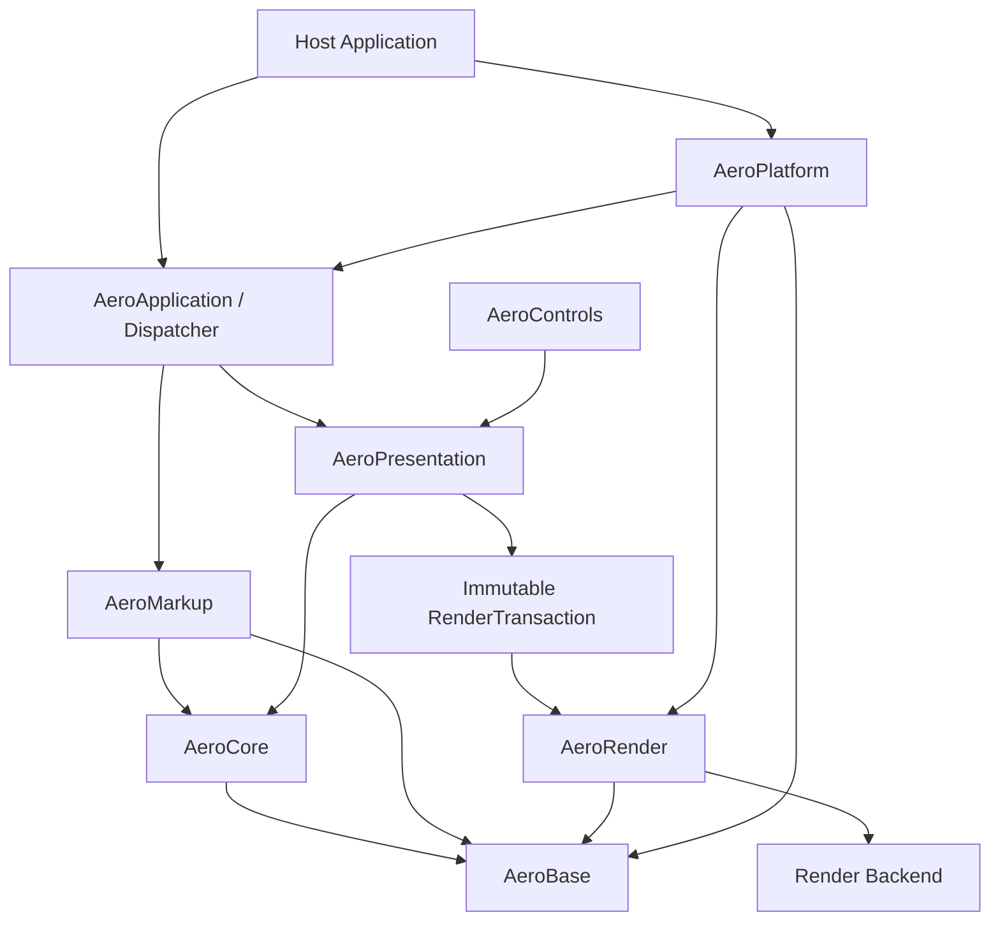

# AeroGUI WPF C++ Port 重构规格

- **状态**：Architecture Baseline
- **版本**：0.1
- **目标语言**：C++20
- **兼容基准**：WPF 公开行为
- **架构参考**：Moonlight 与 NoesisGUI 的公开资料
- **实现模式**：clean-room reimplementation
- **规范用语**：MUST / SHOULD / MAY 分别表示必须、建议和可选

> 仓库当前没有可重构的既有 C++ UI 实现。本规范中的“重构”是指先建立可替代旧式单体 port 的模块边界、行为契约、测试方法和迁移目标，再按垂直切片实现。

## 1. 为什么不能逐类翻译 WPF

逐类把 `System.Windows.*` 改写成 C++ 容易造成：

- 属性、Binding、Style、Animation 和布局互相硬编码；
- 逻辑树、视觉树和渲染数据混成一棵对象树；
- render thread 回调用户对象，引入锁、重入和悬空引用；
- XAML loader 依赖具体控件，无法独立测试或 AOT；
- Win32、字体和 GPU API 渗透到 Core；
- 看起来像 WPF，却没有属性优先级、资源查找和事件顺序的行为测试。

AeroGUI 必须先打通一条最小而完整的主链路：

```text
XAML
 -> Type/Property metadata
 -> Dependency Objects
 -> Logical/Visual Trees
 -> Binding/Resource/Style
 -> Measure/Arrange
 -> RenderTransaction
 -> Render Tree
 -> Backend
```

任何高级功能都必须通过这条链路，禁止形成旁路。

## 2. 目标

AeroGUI MUST：

1. 提供无 CLR 依赖、可嵌入的 C++20 UI runtime；
2. 对已声明支持的 WPF/XAML 子集提供可测试的语义兼容；
3. 实现统一的 Dependency Property、Binding、Resource、Style 和 Template 基础；
4. 分离逻辑树、视觉树和渲染树；
5. 使用 retained-mode render tree 与增量场景事务；
6. 支持单线程和 UI/render 双线程宿主模型；
7. 让宿主拥有窗口、线程、事件循环、文件系统和 GPU device；
8. 允许替换 render、window、text、image 和 accessibility backend；
9. 对未知或部分支持的行为给出稳定诊断；
10. 用 conformance、golden、fuzz、sanitizer 和 performance gates 约束实现。

## 3. 非目标

v1 不承诺：

- WPF/.NET 二进制、ABI 或 C# 源码兼容；
- BAML 兼容；
- FlowDocument、XPS、Printing、MediaElement、WPF 3D 或浏览器插件；
- 首次发布即覆盖全部控件和全部边缘行为；
- 复制 WPF、Moonlight 或 NoesisGUI 的内部实现；
- 在首个版本中自研所有 shaping、字体栅格化和图像 codec。

## 4. 兼容性合同

兼容性分为四层：

| 层级 | 合同 | 验证 |
| --- | --- | --- |
| Syntax | XAML 文法、namespace、type/member resolution | parser/object-writer golden tests |
| Semantic | 属性优先级、资源、Binding、布局、事件路由 | WPF differential probes |
| Visual | 几何、文本位置、颜色、clip、template | layout snapshots + pixel diff |
| API | AeroGUI C++ source compatibility | compile tests + semantic versioning |

每个 release MUST 发布 capability manifest，列出：

- 支持的 XAML namespace；
- markup extensions；
- controls；
- features 的 `core` / `partial` / `unsupported` 状态；
- 已知兼容差异；
- manifest schema version。

加载器和 `aero-xamlc` MUST 使用同一 manifest。未知类型、未知成员、资源循环、Binding path 错误和线程违规不得静默忽略。

## 5. 总体架构



### 5.1 模块职责

| 模块 | 职责 |
| --- | --- |
| `AeroBase` | Result、diagnostics、字符串、URI、集合、内存和公共值类型 |
| `AeroCore` | Object、Dispatcher、TypeRegistry、DependencyProperty、Expression、事件基础 |
| `AeroMarkup` | XAML node stream、schema、object writer、markup extension、compiled XAML IR |
| `AeroPresentation` | Visual/UIElement/FrameworkElement、树、layout、Binding、Resource、Style、Template、Input |
| `AeroControls` | Control、ContentControl、ItemsControl、Panel 和标准控件 |
| `AeroRender` | render tree、scene transactions、drawing lists、batch/cache 和 backend contracts |
| `AeroPlatform` | window、input、IME、clipboard、file、time、DPI 和 accessibility bridges |
| `AeroTestKit` | WPF probes、golden XAML、layout/render snapshots、fuzz harness |

约束：

- Core 不依赖 Presentation、Controls、Platform 或具体 renderer；
- Presentation 不包含 Win32/X11/Cocoa/D3D/Vulkan/Metal 类型；
- Render 不依赖控件类；
- 模块图 MUST 保持有向无环；
- backend 通过注册或工厂注入。

## 6. 四种结构

| 结构 | 用途 |
| --- | --- |
| Object graph | C++ 所有权和一般引用关系 |
| Logical tree | 内容模型、DataContext/属性继承、资源查找 |
| Visual tree | layout、hit test、event route、template visuals |
| Render tree | render domain 的紧凑场景，不含用户对象指针 |

一个 Visual MAY 产生零个、一个或多个 render nodes。Logical parent、visual parent 和 render parent 不要求相同。

## 7. 线程与帧不变量

- 可变 UI 对象只允许在其 Dispatcher 线程访问；
- Core 不创建永久线程；
- UI/render 之间只传递不可变 transaction、稳定 ID 和显式资源消息；
- render thread 不执行 Binding、layout、XAML callback 或 user callback；
- 同一系统既能单线程立即 apply，也能双线程排队 apply；
- platform callback 必须 marshal 到 UI Dispatcher；
- Freezable 只有冻结后才可跨线程只读共享。

标准阶段：

```text
PumpPlatformEvents
 -> DispatchInput
 -> FlushPropertyChanges
 -> UpdateBindings
 -> UpdateAnimations
 -> Measure/Arrange
 -> RaiseLifecycleEvents
 -> BuildRenderTransaction
 -> SubmitRender
```

## 8. 实施原则

1. **公开行为优先于内部相似**：WPF 行为是基准，参考实现只帮助分层。
2. **失效驱动**：property metadata 精确标记 Measure/Arrange/Render/Inheritance 影响。
3. **事务化变更**：property、tree、template 和 render commit 不暴露半更新状态。
4. **先垂直切片**：禁止先批量创建空控件类。
5. **诊断优先**：不支持的 XAML 和 runtime 状态必须可定位。
6. **测试可重复**：时间、字体、DPI、资源和 backend fixtures 可锁定。
7. **先 source compatibility**：v1 不承诺 C++ ABI。

## 9. 规范分章

以下文件与本文件具有相同规范效力：

- [`spec/CORE_RUNTIME.md`](spec/CORE_RUNTIME.md)：对象生命周期、Dispatcher、反射、Dependency Property 和树事务；
- [`spec/XAML_PRESENTATION.md`](spec/XAML_PRESENTATION.md)：XAML、资源、Binding、Layout、事件、Style、Template 和 Controls；
- [`spec/RENDERING_PLATFORM.md`](spec/RENDERING_PLATFORM.md)：render transaction、render tree、backend、platform、text 和 image；
- [`spec/QUALITY_ROADMAP.md`](spec/QUALITY_ROADMAP.md)：diagnostics、build、测试、性能、安全、里程碑和验收。

冲突时，优先级为：最新 Accepted ADR > 本主规范 > 分章规范 > README 示例。

## 10. 已决策事项

| ID | 决策 | 状态 |
| --- | --- | --- |
| D-001 | C++20、无 CLR 的 clean-room runtime | Accepted |
| D-002 | WPF 公开语义是主要兼容基准 | Accepted |
| D-003 | intrusive `Ref<T>` / `WeakRef<T>` | Accepted |
| D-004 | logical、visual、render tree 分离 | Accepted |
| D-005 | retained render tree + immutable transactions | Accepted |
| D-006 | 宿主拥有线程，Core 不创建永久线程 | Accepted |
| D-007 | runtime 与 compiled XAML 共享 node/object-writer 语义 | Accepted |
| D-008 | Skia 可作为首个 reference backend，Core 不绑定 Skia | Proposed |
| D-009 | v1 只保证 source compatibility | Accepted |
| D-010 | BAML、FlowDocument、WPF 3D 不进入 v1 | Accepted |

`Proposed` 决策在实现前必须通过 ADR 接受或替换。

## 11. Clean-room 与许可证

### WPF

允许阅读公开文档、调用公开 API、编写行为测试和记录可观察结果。禁止依赖 WPF 私有实现细节。

### Moonlight

Moonlight 只作为跨平台原生 runtime、宿主边界和可替换 render backend 的历史参考。默认不复制其源码。任何源码级复用都必须单独评估许可证、隔离方式和 NOTICE。

### NoesisGUI

只允许参考公开文档中的架构概念。禁止提交 SDK 私有源码、反编译结果、受 NDA/许可限制的材料、私有 shader 或序列化格式。

## 12. 参考资料

### WPF

- <https://learn.microsoft.com/dotnet/desktop/wpf/advanced/wpf-architecture>
- <https://learn.microsoft.com/dotnet/desktop/wpf/properties/dependency-properties-overview>
- <https://learn.microsoft.com/dotnet/desktop/wpf/properties/dependency-property-value-precedence>
- <https://learn.microsoft.com/dotnet/desktop/wpf/advanced/layout>
- <https://learn.microsoft.com/dotnet/desktop/wpf/advanced/trees-in-wpf>
- <https://learn.microsoft.com/dotnet/desktop/wpf/events/routed-events-overview>
- <https://learn.microsoft.com/dotnet/desktop/wpf/data/>
- <https://learn.microsoft.com/dotnet/desktop/wpf/advanced/threading-model>

### Moonlight

- <https://www.mono-project.com/docs/web/moonlight/>
- <https://www.mono-project.com/archived/release_notes_moonlight4_preview/>
- <https://www.mono-project.com/archived/moonlightnotes/>

### NoesisGUI

- <https://www.noesisengine.com/docs/Gui.Core.Architecture.html>
- <https://www.noesisengine.com/docs/Gui.DependencySystem.Index.html>
- <https://www.noesisengine.com/docs/Gui.Core.RenderingTutorial.html>
- <https://www.noesisengine.com/docs/Gui.Core.Resources.html>
- <https://www.noesisengine.com/docs/Gui.Core.Binding.html>
